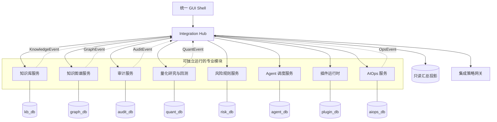

# 超级审计、量化与知识智能中枢总体设计——模块自治版

> 版本：1.0-modular  
> 日期：2026-09-03  
> 目的：把原“统一中枢优先”方案调整为“模块独立开发、契约连接、最终汇总”，降低早期权限、RLS、审批和控制平面对业务调试的阻碍。  
> 原则：本文件不覆盖原设计；原设计保留为生产安全目标，本文件作为开发与集成的优先实施蓝图。

## 0. 核心决定

系统不再要求所有模块从第一天接入同一个控制平面、同一套 RLS、统一 Policy Gateway 和统一数据库迁移链。改为：

1. 知识库、知识图谱、审计、量化、风控、Agent 调度、插件、AIOps、GUI 分别作为可独立启动、独立测试、独立演示的产品模块。
2. 每个模块拥有自己的 API、数据库迁移、任务队列适配器、文件目录、测试和简化开发权限。
3. 模块之间只通过版本化契约、ArtifactRef 和事件通信，不直接读取其他模块私有表。
4. 开发态默认启用“模块内自动允许”，仅保留不可覆盖的硬黑名单；统一审批、跨租户 RLS、授权租约在集成态启用。
5. 最后由 Integration Hub 汇总模块注册信息、只读状态、事件和 GUI 贡献；Hub 不拥有各模块业务真相。
6. 生产态继续保留原方案的确定性风控、信息墙、审计链和不可逆动作审批，但它们不再阻塞单模块功能开发。

一句话概括：

```text
先让每个专业脑独立成为可用产品，再通过契约把它们组网；
先验证业务能力，再逐级加上集成安全，不用生产权限模型阻塞本地调试。
```

## 1. 为什么需要重构开发模式

原方案的安全目标没有错，但以下内容被过早设为所有功能的前置条件：

- 所有请求都必须有租户、身份、trace、幂等键和统一审批；
- 所有模块都依赖中央 Policy Gateway 才能写入；
- 所有业务表从第一天启用强制 RLS；
- 所有模块共享一个数据库、一个迁移 head 和大量跨 schema 外键；
- GUI 的每个按钮都必须先完成插件注册、能力解析、审批和授权租约；
- 导入、图谱、审计、量化和 AIOps 被放在同一个阶段序列中，前一阶段未完成就无法调试后一模块。

这些规则适合最终生产系统，却会产生三类开发问题：

1. **局部功能无法独立运行**：知识库上传失败可能不是解析器问题，而是策略表、租户或审批配置问题。
2. **故障定位困难**：一个按钮同时经过 GUI、统一 API、Policy、RLS、调度、Worker、知识服务，无法快速判断故障属于哪一层。
3. **并行开发冲突**：多个 AI 或开发者同时修改主 API、单一 Alembic 链和共享表，容易产生 migration head、权限和测试数据冲突。

新版把“模块正确性”和“系统级治理”拆成两个可分别验收的维度。

## 2. 目标架构：联邦模块 + 汇总中枢



关键边界：

- 模块数据库是业务真相；汇总投影可随时重建。
- Hub 调用模块公开 API，不连接模块私有表。
- 模块可在没有 Hub、Policy Service、统一登录和消息总线时独立运行。
- 集成时通过 Adapter 把本地直接调用替换为 HTTP/Event 调用，核心业务代码不改变。

## 3. 模块地图

| 模块 | 独立目标 | 自有数据 | 对外契约 | 不应依赖 |
| --- | --- | --- | --- | --- |
| Knowledge Library | 文件夹上传、解析、分块、检索、版本、回收站 | 文件、文档、分块、解析任务、版本 | `KnowledgeItem`、`DocumentChunk`、`KnowledgeEvent` | 审计、量化、统一 Agent |
| Knowledge Graph | 多图空间、实体、关系、冲突、发布、回滚 | 图空间、节点、边、别名、ChangeSet | `GraphNodeRef`、`GraphQuery`、`GraphEvent` | 知识库私有表 |
| Audit | 总账/凭证/合同/代码审计、证据、发现、底稿 | Engagement、Evidence、Claim、Finding | `EvidenceRef`、`AuditFinding` | 量化与 AIOps 私有数据 |
| Quant | 数据快照、因子、回测、实验、组合风控 | Dataset、Factor、Experiment、Backtest | `QuantArtifact`、`RiskSignal` | 审计客户机密数据 |
| Risk & Policy | 白黑名单、风险评分、模拟、集成审批 | Rule、Decision、Lease、Freeze | `CapabilityRequest`、`PolicyDecision` | 任何领域业务表 |
| Agent Orchestrator | Mission、DAG、Task、AgentRun、重试 | Workflow、Run、Task、Checkpoint | `TaskEnvelope`、`RunEvent` | 领域数据库直连 |
| Plugin Runtime | Manifest、能力、适配器、UIContribution | Plugin、Version、Capability | `PluginManifest`、`UIContribution` | 直接修改 GUI Shell |
| AIOps | 告警、事故、RCA、Playbook、验证、回滚 | Alert、Incident、ChangeRequest、Execution | `IncidentEvent`、`RemediationProposal` | 任意命令默认执行权 |
| GUI Shell | 模块导航、状态、统一搜索、最终汇总 | 用户偏好、模块注册缓存 | `ModuleDescriptor`、`UIContribution` | 各模块私有数据库 |
| Integration Hub | 注册、事件路由、只读汇总、跨模块工作流 | Registry、Projection、IntegrationRun | 所有公共契约 | 成为第二份业务真相 |

## 4. 四种运行档位

安全机制不删除，而是按运行档位逐级启用。

| 档位 | 用途 | 身份与租户 | Policy | RLS | 审批 | 外部副作用 |
| --- | --- | --- | --- | --- | --- | --- |
| `MODULE_DEV` | 单模块快速开发 | 固定 `local-dev`，可由适配器自动补全 | 模块白名单自动允许 | 可关闭或单租户简化 | 不弹窗 | 仅模块目录与本地测试资源 |
| `MODULE_TEST` | 模块真实验收 | 测试租户/测试身份 | 记录并判定，低风险自动 | 测试跨租户隔离 | 仅高风险 | 禁止真实交易/生产变更 |
| `INTEGRATION` | 多模块组网 | 统一身份映射 | 统一 Policy Gateway | 对跨模块接口强制 | 跨域与高风险审批 | 仅显式集成白名单 |
| `PRODUCTION` | 长期运行 | 完整 IAM | 全量规则、租约、冻结 | 强制 RLS/最小权限 | 按风险等级 | 生产凭证与双重防护 |

### 4.1 `MODULE_DEV` 的默认权限

模块开发态应默认允许：

- 在模块自己的数据目录中创建、修改、移动和软删除文件；
- 连接模块自己的开发数据库并执行本模块 migration；
- 调用本机已配置解析器，如 MinerU、本地 OCR、FFmpeg、本地转写模型；
- 执行本模块测试、类型检查和开发服务器；
- 写入本模块日志、缓存、临时目录和测试工件。

始终拒绝：

- 对磁盘根目录、用户目录或工作区根执行递归删除；
- 读取未声明的凭证、浏览器密钥、其他模块私有目录；
- 将审计机密或本地文件上传到未授权外部域名；
- 真实券商下单、生产数据库删除、生产 AIOps 变更；
- 由文件名、文档内容或插件 manifest 直接拼接并执行 shell 命令。

这意味着开发态 Policy 是一个窄而清晰的本地能力白名单，不是全系统审批中心。

### 4.2 建议的独立开发端口

| 服务 | 端口 |
| --- | ---: |
| Knowledge Library | 8101 |
| Knowledge Graph | 8102 |
| Audit | 8103 |
| Quant | 8104 |
| Risk & Policy | 8105 |
| Agent Orchestrator | 8106 |
| AIOps | 8107 |
| Plugin Runtime | 8108 |
| GUI Shell | 8109 |
| Integration Hub | 8010 |

端口只作为本机默认值，可由环境变量覆盖。各模块不能把其他模块端口写死在领域代码中，只能通过 Adapter 配置发现。

## 5. 模块统一形态

每个模块交付相同的外壳，便于最终汇总：

```text
modules/<module_name>/
  AGENTS.md                 # 仅本模块边界与命令
  README.md                 # 独立启动与演示
  pyproject.toml/package.json
  contracts/               # 输入、输出、事件、错误契约
  app/                     # API/worker/GUI
  domain/                  # 不依赖 Hub/Policy/其他模块
  adapters/                # DB、文件、模型、Policy、EventBus
  migrations/              # 本模块独立迁移链
  tests/
    unit/
    contract/
    integration/
    e2e/
  docs/status.md
```

每个模块必须提供：

- `GET /health`：仅反映本模块健康；
- `GET /descriptor`：模块名称、版本、能力、API/事件/UI 契约版本；
- 自己的启动命令和开发数据；
- InMemory/Local 与 Integration 两套适配器；
- 明确的错误码，不返回其他模块内部异常；
- 契约测试包，供 Hub 在不访问源码的情况下验证兼容性。

## 6. 连接契约

### 6.1 公共 Envelope

模块间请求和事件只使用最小公共 Envelope：

```json
{
  "schema": "audit-network.event.v1",
  "event_id": "uuid",
  "event_type": "knowledge.document.ready",
  "source_module": "knowledge-library",
  "occurred_at": "2026-09-03T00:00:00Z",
  "trace_id": "uuid",
  "tenant_ref": "local-dev",
  "resource_ref": {"kind": "document", "id": "uuid", "version": "3"},
  "payload": {},
  "extensions": {}
}
```

在 `MODULE_DEV` 中，`trace_id` 和 `tenant_ref` 可由模块中间件自动生成；业务函数不需要手工传递。进入 Integration 后由 Hub 注入并校验。

### 6.2 ArtifactRef

大文件和领域工件不穿过消息总线，只传引用：

```json
{
  "artifact_id": "uuid",
  "owner_module": "knowledge-library",
  "media_type": "application/pdf",
  "sha256": "...",
  "version": 1,
  "access_uri": "/api/v1/artifacts/{id}",
  "classification": "internal"
}
```

接收模块通过 API 获取授权视图，不读取发送方文件路径。

### 6.3 PolicyPort

领域代码只依赖抽象接口：

```text
PolicyPort.evaluate(CapabilityRequest) -> PolicyDecision
```

适配器分为：

- `LocalAllowlistPolicy`：模块开发态，显式能力白名单，硬黑名单保留；
- `RecordingPolicy`：模块测试态，记录决策但低风险自动执行；
- `RemotePolicyGateway`：集成/生产态，调用统一策略服务。

禁止在领域服务内部直接查询中央策略表或审批表。

## 7. GUI：先独立工作台，后统一 Shell

每个模块先实现自己的可用工作台：

- Knowledge：文件夹树、上传、处理进度、文档预览、回收站；
- Graph：空间树、节点/边编辑、冲突、版本 diff；
- Audit：项目、证据、候选异常、底稿、报告；
- Quant：数据、因子、实验、回测、监控；
- AIOps：告警、事故、RCA、变更与验证；
- Agent：Mission、DAG、运行状态与重试。

完成后，每个模块通过 `ModuleDescriptor + UIContribution` 注册到统一 Shell。Shell 负责导航、主题、统一身份和跨模块跳转，但不重写模块业务页面。

建议兼容顺序：

1. 同源 iframe/反向代理挂载，最容易独立开发；
2. 声明式卡片和表格贡献，用于统一首页；
3. 稳定后再抽取共享前端组件；
4. 不要求所有模块一开始采用同一前端框架。

## 8. 最终汇总方式

Integration Hub 只承担六项职责：

1. 模块注册和健康发现；
2. 契约版本协商；
3. 事件路由与重放；
4. 跨模块工作流编排；
5. 统一 Policy Gateway 和身份映射；
6. 可重建的只读汇总投影与统一 GUI 首页。

Hub 不承担：

- 保存文档正文、图谱节点、审计证据或量化行情的权威副本；
- 通过数据库外键保证跨模块一致性；
- 直接执行领域插件；
- 替代模块自己的健康检查和恢复机制。

跨模块一致性采用 Saga/补偿，不采用分布式数据库事务。例如：

```text
Knowledge 文档发布
  → 发出 document.ready
  → Graph 创建抽取任务
  → Graph 发布 graph.release
  → Hub 更新只读投影
失败时保留 Knowledge 发布，Graph 标记待重试，不回滚原始文档。
```

## 9. 独立开发顺序

各模块可并行开发，不再互相设为前置条件：

| 轨道 | 首个可用版本 | 独立验收 |
| --- | --- | --- |
| K1 Knowledge | 上传、解析、检索、版本、回收站 | 无 Hub/Policy 服务可运行 |
| K2 Graph | 图空间、节点边、查询、版本 | 用测试文档事件独立运行 |
| A1 Audit | CSV/Excel、证据、异常、底稿 | 使用本模块样例数据 |
| Q1 Quant | 数据快照、因子、回测、实验 | 禁止真实下单即可独立运行 |
| O1 AIOps | 告警、RCA、修复提案、dry-run | 不连接生产执行器 |
| C1 Agent | Mission、DAG、任务租约、重试 | 用内置测试能力执行 |
| P1 Plugin | Manifest、能力注册、隔离测试 | 用样例插件验证 |
| G1 GUI | 模块注册、导航、健康总览 | 通过 mock descriptor 验证 |
| I1 Integration | 契约、事件、身份、Policy 接入 | 至少两个真实模块组网 |

每条轨道都经过四个小阶段：

```text
M0 契约与模块骨架
M1 独立业务 MVP
M2 真实数据库/文件/Worker 验收
M3 Integration Adapter 与系统契约测试
```

某模块达到 M3 不要求其他模块达到 M3。

## 10. 模块完成定义

一个模块只有同时满足以下条件才可标记“独立完成”：

1. 无 Hub、统一 Policy、统一消息总线时可启动；
2. 核心业务路径有真实数据 E2E，不只依赖 mock；
3. 数据库能从空库迁移到当前 head；
4. 重复请求、Worker 重启和失败重试不会产生重复副作用；
5. 自有 GUI 能完成模块核心操作；
6. 文件删除使用回收站或版本化删除，证据不可硬删除；
7. Descriptor、API、事件、ArtifactRef 契约测试通过；
8. 开发态能力白名单明确，硬黑名单测试通过；
9. `docs/status.md` 如实记录限制；
10. 提供 Integration Adapter，但不要求实际 Hub 已完成。

## 11. 给开发 AI 的任务模板

```text
你本轮只开发 <module-name> 模块。

先阅读该模块的 AGENTS.md、contracts 和 status，不读取或修改其他模块私有实现。
模块必须在 MODULE_DEV 档位独立启动，不得把统一登录、RLS、Policy Gateway、
审批中心、NATS、Temporal 或其他领域数据库作为本模块 MVP 前置条件。

领域代码通过 PolicyPort/EventPort/ArtifactPort 抽象连接外部能力；本地适配器默认
启用明确的模块白名单并保留硬黑名单。先写契约和测试，再实现逻辑。

完成后运行本模块 unit/contract/integration/e2e，更新模块 docs/status.md，报告：
实际完成、文件、迁移、真实测试结果、已知限制、Integration Adapter 状态。
不要顺手开发其他模块，不要修改统一中枢来掩盖模块缺口。
```

## 12. 与原设计的关系

原设计继续作为以下内容的生产目标：

- 不可覆盖黑名单；
- 审计与量化信息墙；
- 高风险动作审批和授权租约；
- 生产 RLS、最小权限和身份隔离；
- 证据、决策、动作的可追溯性；
- 真实交易和生产自愈的双重保护。

本设计改变的是实现顺序和耦合方式，不是取消生产安全。最终系统仍安全，但开发过程不再要求每个本地上传、解析和页面按钮先穿过尚未成熟的全局治理链。
