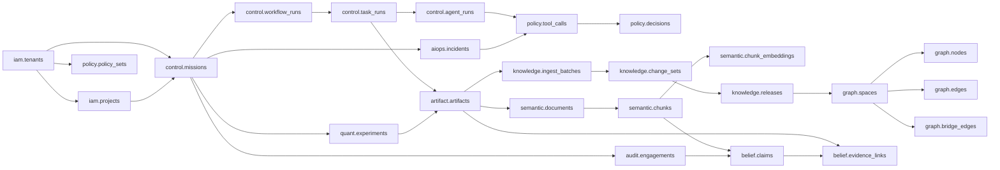

# 超级审计、量化与 AIOps 中枢：数据库架构与 AI 开发实施方案

> 文档性质：可直接交给编码 AI 的执行规格  
> 版本：1.0  
> 日期：2026-09-02  
> 上位设计：`D:/pythonpro/audit_network/超级审计与量化智能中枢总体设计.md`  
> 当前工作区：`D:/pythonpro/audit_network`

---

## 0. 给执行 AI 的开工指令

你正在实现一个长期运行的多 Agent 中枢。它包含知识工厂、审计脑、量化脑、AIOps 脑、插件组网、审批和全自动风控。

开始编码前必须完整阅读本文件和上位设计。以下规则不可省略：

1. **按阶段施工**：一次只完成一个 Phase；每个 Phase 测试通过、生成验收报告后才能进入下一阶段。
2. **数据库迁移优先**：任何表结构变化必须通过 Alembic/SQL migration；禁止应用启动时临时 `CREATE TABLE`。
3. **先契约后实现**：先写 JSON Schema/Pydantic 类型和测试，再写服务逻辑。
4. **禁止把运行状态放在内存当真相**：Mission、任务、审批、导入批次、ChangeSet、Incident 和发布状态必须落库。
5. **禁止硬删除证据**：原始工件、审计证据、知识发布历史和策略决定只追加；业务对象删除进入回收站。
6. **所有副作用先过策略网关**：Agent 无权凭自然语言宣布“已批准”。执行器只接受 Policy Service 签发的授权票据。
7. **所有后台任务幂等**：每个任务必须有 `idempotency_key`；重复执行不能产生重复节点、重复边、重复订单或重复外部动作。
8. **多租户和 Agent 隔离从第一天实现**：所有业务表有 `tenant_id`；所有业务连接受 RLS 约束。
9. **先实现单机可运行版本**：PostgreSQL + API + Worker + Web；NATS、Temporal、MinIO 可以按阶段接入，但接口必须预留。
10. **不一次性生成全部系统**：如果当前 Phase 的前置条件不存在，停止并报告，不要用假实现掩盖。
11. **保留用户已有文件和改动**：不得重置工作区、覆盖用户文件或删除参考项目。
12. **每阶段更新文档**：维护 `docs/status.md`、`docs/decisions/`、迁移清单和测试结果。

参考优先级：先检查 Obsidian 知识库中已成功运行的知识库、知音预测和量化回测项目，再检查 `cankao` 与 AIOps 参考项目；只提取可验证的契约、数据模型和测试经验，不直接复制私有实现。

实现优先级：**数据库正确性 > 权限与证据链 > 可恢复性 > 功能数量 > UI 美化**。

---

## 1. 第一版范围与技术基线

### 1.1 第一版必须跑通的五条纵向链路

1. 知识工厂：文件投递 → 扫描 → 解析/OCR → 分块 → 向量化 → 图谱抽取 → staging → 验证 → 发布 → 检索。
2. 代码/插件审计：Git/目录快照 → Sweep → 假设 → 深挖 → QA → 报告与证据链。
3. 财务数据审计：总账导入 → 数据质量 → 异常候选 → 调查 → 底稿草稿。
4. 量化健康监控：数据新鲜度 → 因子一致性 → 回测/漂移 → 模拟盘风险报告。
5. AIOps：告警 → 收敛 → RCA → 修复提案 → 策略审批 → canary → 验证/回滚。

### 1.2 技术基线

| 层 | 第一版选择 |
|---|---|
| 数据库 | PostgreSQL 16；开发优先使用本机原生服务，不要求 Docker |
| 扩展 | `pgcrypto`、`pg_trgm`、`vector`、`ltree`；`pgrouting` 可选 |
| API | Python 3.12 + FastAPI + Pydantic v2 |
| ORM/迁移 | SQLAlchemy 2.x + Alembic；复杂检索允许手写参数化 SQL |
| Worker | 第一版 PG Outbox + 租约 Worker；Phase 8 接 Temporal/NATS |
| 大文件 | 第一版本地内容寻址存储；接口兼容 MinIO/S3 |
| 前端 | React + TypeScript + React Flow + ECharts/Cytoscape.js |
| 测试 | pytest、独立测试 PG、Playwright；不把 Testcontainers 作为必需项 |
| 可观测性 | 结构化日志 + OpenTelemetry trace id；Phase 8 完整接入 |

### 1.3 第一版明确不做

- 不做真实证券自动下单。
- 不把审计客户未公开数据传给量化域。
- 不允许 Agent 自动安装未签名插件。
- 不允许 Agent 修改不可覆盖黑名单。
- 不采用一张无边界的全局知识图。
- 不在活动知识图上直接执行未经审核的自进化修改。

---

## 2. 数据库总体关系



### 2.1 Schema 列表

| Schema | 权威内容 |
|---|---|
| `iam` | 租户、项目、用户、角色、服务身份、Agent 身份 |
| `policy` | 权限预设、白黑名单、规则、审批、授权租约、工具调用 |
| `catalog` | 插件、插件版本、能力、输入输出契约、运行时实例 |
| `control` | Mission、工作流版本、运行、任务、Agent 运行、租约、黑板 |
| `event` | outbox、inbox、DLQ、领域事件索引 |
| `artifact` | 内容寻址文件、工件、血缘、引用 |
| `semantic` | 文档、版本、分块、全文索引、embedding |
| `graph` | 多层图空间、节点、边、桥接边、别名、社区、Gateway |
| `knowledge` | 导入源、批次、ChangeSet、发布、冲突、回收站 |
| `belief` | Claim、支持/反驳证据、置信分解、决策 |
| `audit` | 审计项目、认定、风险、控制、程序、样本、发现、底稿 |
| `quant` | 数据快照、因子、实验、回测、信号、组合和风险结果 |
| `aiops` | 服务、SLO、告警、事故、RCA、Playbook、执行和验证 |
| `risk` | 风险预算、限额、评估、冻结和事故 |
| `ops` | 心跳、模型调用、成本、备份、维护和健康汇总 |

---

## 3. 全库设计约定

### 3.1 标识与时间

- 业务主键统一 `uuid`，默认 `gen_random_uuid()`。
- 高频追加表可使用 `bigint generated always as identity` 作为物理顺序键，同时保留业务 UUID。
- 所有时间使用 `timestamptz`，数据库和应用统一 UTC；GUI 转本地时区。
- 表至少包含 `created_at`；可变业务对象同时包含 `updated_at`。
- 所有请求传播 `trace_id`、`mission_id`、`run_id`、`task_id`。

### 3.2 租户、项目和领域

- 所有业务表必须有 `tenant_id uuid not null`。
- 项目范围数据增加 `project_id uuid`。
- 跨域对象增加 `domain text`，允许值：`knowledge/audit/quant/aiops/platform`。
- 主键即使全局唯一，唯一约束仍优先以 `(tenant_id, ...)` 表达业务边界。

### 3.3 状态字段

不使用 PostgreSQL ENUM，避免未来增加状态时锁表。使用 `text + check constraint` 或状态字典表。

统一状态词：

- 生命周期：`draft/staging/active/superseded/archived/trashed`。
- 任务：`pending/leased/running/waiting/succeeded/failed/cancelled/dead_letter`。
- 审核：`allow/deny/review/pending/expired/revoked`。
- Claim：`proposed/investigating/supported/contradicted/confirmed/rejected`。

### 3.4 JSONB 使用边界

JSONB 仅用于：插件自定义配置、模型输出原文、可扩展属性、策略 DSL、外部系统原始 payload。

以下字段必须结构化列，不能只塞 JSONB：状态、租户、项目、时间、类型、来源、置信度、风险分、版本、发布、删除、权限、幂等键。

### 3.5 软删除与不可变数据

普通可管理对象：

```text
deleted_at timestamptz
deleted_by uuid
delete_reason text
recycle_entry_id uuid
```

不可硬删除对象：原始 blob、证据工件、发布记录、ChangeSet、策略决定、审批记录、工具调用和审计事件。

### 3.6 乐观锁

可编辑对象增加 `row_version bigint not null default 1`。更新时：

```sql
UPDATE ...
SET ..., row_version = row_version + 1
WHERE id = :id AND row_version = :expected;
```

影响行数为 0 时返回 `409 Conflict`。

### 3.7 RLS 模式

业务请求开启事务后设置：

```sql
SET LOCAL app.tenant_id = '...';
SET LOCAL app.user_id = '...';
SET LOCAL app.project_ids = 'uuid1,uuid2';
```

标准租户策略：

```sql
ALTER TABLE semantic.documents ENABLE ROW LEVEL SECURITY;
ALTER TABLE semantic.documents FORCE ROW LEVEL SECURITY;

CREATE POLICY tenant_isolation ON semantic.documents
USING (tenant_id = current_setting('app.tenant_id', true)::uuid)
WITH CHECK (tenant_id = current_setting('app.tenant_id', true)::uuid);
```

迁移所有者与应用角色分开。应用角色不得拥有 `BYPASSRLS`，不得使用表所有者账号连接。

---

## 4. 迁移文件顺序

```text
migrations/versions/
  0001_extensions.py
  0002_schemas_and_roles.py
  0003_iam.py
  0004_policy.py
  0005_catalog.py
  0006_control.py
  0007_event.py
  0008_artifact.py
  0009_semantic.py
  0010_graph.py
  0011_knowledge.py
  0012_belief.py
  0013_audit.py
  0014_quant.py
  0015_aiops.py
  0016_risk_ops.py
  0017_rls.py
  0018_indexes_and_partitions.py
  0019_seed_defaults.py
  0020_views_and_functions.py
```

每个迁移必须同时具备 upgrade、downgrade（不可逆数据迁移除外）和迁移测试。生产禁止启动时自动 upgrade；部署流程显式执行。

---

## 5. 核心表数据字典

下列字段为最低要求。实现 AI 可以增加必要字段，但不得删改语义。

### 5.1 `iam`

#### `iam.tenants`

| 字段 | 类型 | 说明 |
|---|---|---|
| `id` | uuid PK | 租户 |
| `slug` | text unique | 稳定标识 |
| `name` | text | 名称 |
| `status` | text | active/suspended/archived |
| `settings` | jsonb | 非敏感设置 |
| `created_at/updated_at` | timestamptz | 时间 |

#### `iam.projects`

`id, tenant_id, parent_project_id, domain, slug, name, root_path, classification, status, settings, created_at, updated_at`。

唯一：`(tenant_id, slug)`。`root_path` 只保存规范化绝对路径，不作为权限本身。

#### `iam.principals`

用户、服务、Agent 共用身份：

`id, tenant_id, principal_type(user/service/agent), external_subject, display_name, status, metadata, created_at`。

#### `iam.roles / iam.role_bindings`

- roles：`id, tenant_id, key, name, permissions jsonb`。
- bindings：`tenant_id, principal_id, role_id, project_id nullable, expires_at`。

### 5.2 `policy`

#### `policy.permission_presets`

`id, tenant_id, key, name, sandbox_mode, approval_mode, is_default, immutable, config, created_at`。

预置：`READ_ONLY / WORKSPACE_ASK / AUTO_GUARDED / AUTO_FULL / LOCKDOWN`。

#### `policy.policy_sets`

`id, tenant_id, project_id, name, version, status, mode, parent_id, checksum, rules_json, created_by, created_at, activated_at`。

激活后不可修改；修改产生新版本。

#### `policy.rules`

`id, tenant_id, policy_set_id, priority, effect(allow/deny/review), capability, scope_type, scope_ref, matcher_json, overridable, enabled, description`。

索引：`(tenant_id, policy_set_id, enabled, priority desc)`、`(capability)`。

#### `policy.tool_calls`

`id, tenant_id, project_id, mission_id, task_run_id, agent_run_id, tool_name, capability, raw_arguments, normalized_effects, argument_hash, requested_at, decision_id, authorization_lease_id, execution_status, started_at, finished_at, result_artifact_id, error_code, trace_id`。

这是高频审计表，按 `requested_at` 月分区。

#### `policy.decisions`

`id, tenant_id, tool_call_id, policy_set_id, policy_version, decision, risk_score, matched_rule_ids, reviewer_type, reviewer_id, reason, decision_payload, decided_at, signature_hash`。

只追加；`tool_call_id` 一次最终决定唯一。

#### `policy.approval_requests`

`id, tenant_id, tool_call_id, status, requested_role, reason, expires_at, created_at, decided_at`。

#### `policy.approval_responses`

`id, tenant_id, request_id, actor_id, outcome, scope(once/session/lease/permanent_rule), reason, constraints, created_at`。

#### `policy.authorization_leases`

`id, tenant_id, project_id, principal_id, capability, constraints, argument_hash nullable, max_calls, used_calls, valid_from, valid_until, status, issued_by_decision_id, token_hash`。

数据库只存 token 哈希，不存可重放的明文票据。

### 5.3 `catalog`

#### `catalog.plugins`

`id, tenant_id, key, name, category, owner, status, description, created_at`。

#### `catalog.plugin_versions`

`id, tenant_id, plugin_id, version, manifest_json, package_uri, package_sha256, signature, runtime, entrypoint, side_effect_class, status, published_at`。

唯一：`(tenant_id, plugin_id, version)`。已发布版本不可覆盖。

#### `catalog.capabilities`

`id, tenant_id, key, description, risk_class, input_schema, output_schema`。

#### `catalog.plugin_capabilities`

`tenant_id, plugin_version_id, capability_id, direction(provides/requires), config`。

#### `catalog.plugin_instances`

`id, tenant_id, project_id, plugin_version_id, node_id, status, health, config_encrypted_ref, last_heartbeat_at, created_at`。

#### `catalog.ui_contributions`

`id, tenant_id, plugin_version_id, contribution_key, schema_version, contribution_type, slot, title_key, icon, route, renderer, data_contract, action_contract, config_json, checksum, status, created_at`。

唯一：`(tenant_id, plugin_version_id, contribution_key)`。发布后不可原地修改；升级产生新插件版本。`contribution_type` 最低支持 `navigation/page/card/table/form/chart/graph/action/settings`。

#### `catalog.ui_renderer_versions`

`id, renderer_key, version, protocol_version, bundle_uri nullable, bundle_sha256 nullable, trust_level, sandbox_mode, supported_schema_range, status, created_at`。

核心渲染器没有外部 bundle。扩展渲染器必须签名，默认 `sandbox_mode=iframe`，不得以内联脚本方式进入主应用。

#### `catalog.ui_preferences`

`id, tenant_id, project_id nullable, principal_id nullable, contribution_id, enabled, placement_override nullable, display_order, settings_json, version, updated_at`。

偏好只能隐藏、排序和填写插件声明的 `settings_schema`，不能扩大数据权限、动作权限或网络权限。

### 5.4 `control`

#### `control.missions`

`id, tenant_id, project_id, domain, title, objective, acceptance_criteria, priority, autonomy_mode, budget_json, status, requested_by, created_at, started_at, finished_at`。

#### `control.workflow_definitions`

`id, tenant_id, key, name, domain, status, created_at`。

#### `control.workflow_versions`

`id, tenant_id, workflow_id, version, graph_json, input_schema, output_schema, checksum, status, created_by, created_at`。

#### `control.workflow_runs`

`id, tenant_id, project_id, mission_id, workflow_version_id, status, input_payload, output_artifact_id, current_revision, started_at, finished_at, temporal_workflow_id nullable, trace_id`。

#### `control.task_runs`

`id, tenant_id, project_id, workflow_run_id, node_key, plugin_version_id, capability, status, priority, attempt, max_attempts, idempotency_key, input_artifact_ids, output_artifact_ids, lease_id, scheduled_at, started_at, finished_at, error_code, error_detail, trace_id`。

唯一：`(tenant_id, idempotency_key)`。

#### `control.agent_runs`

`id, tenant_id, project_id, task_run_id, principal_id, role_key, model_key, prompt_template_version, status, context_snapshot_artifact_id, token_input, token_output, cost, started_at, finished_at`。

#### `control.leases`

`id, tenant_id, resource_type, resource_id, holder_id, lease_token_hash, acquired_at, heartbeat_at, expires_at, status`。

#### `control.blackboard_entries`

`id, tenant_id, project_id, mission_id, key, entry_type, artifact_id, value_json, visibility, created_by, created_at, expires_at`。

黑板只存小值或 ArtifactRef，不存大文本和二进制。

### 5.5 `event`

#### `event.outbox`

`seq bigint identity, event_id uuid, tenant_id, aggregate_type, aggregate_id, event_type, payload, headers, created_at, published_at, attempts, next_attempt_at, last_error`。

业务事务和 outbox insert 必须同一事务提交。

#### `event.inbox`

`consumer_key, event_id, tenant_id, received_at, processed_at, status, error`；PK `(consumer_key, event_id)`。

#### `event.dead_letters`

`id, tenant_id, source, event_id, payload, error_class, error_detail, attempts, created_at, replayed_at, replay_task_id`。

### 5.6 `artifact`

#### `artifact.blobs`

`id, tenant_id, sha256, size_bytes, mime_type, storage_backend, storage_key, encryption_key_ref, created_at, verified_at`。

唯一：`(tenant_id, sha256)`。不要跨租户内容去重，避免侧信道泄露。

#### `artifact.artifacts`

`id, tenant_id, project_id, blob_id nullable, artifact_type, name, version, classification, producer_type, producer_id, source_uri, metadata, created_at`。

#### `artifact.lineage_edges`

`id, tenant_id, source_artifact_id, target_artifact_id, relation_type(derived_from/parsed_from/summarized_from/validated_by), task_run_id, created_at`。

#### `artifact.references`

把工件连接到领域对象：`tenant_id, artifact_id, owner_schema, owner_type, owner_id, purpose, created_at`。

### 5.7 `semantic`

#### `semantic.documents`

`id, tenant_id, project_id, canonical_uri, title, document_type, domain, classification, current_version_id, status, created_at, updated_at, deleted_at`。

#### `semantic.document_versions`

`id, tenant_id, document_id, version, source_artifact_id, content_sha256, parser_key, parser_version, language, page_count, metadata, created_at`。

#### `semantic.chunks`

`id, tenant_id, project_id, document_version_id, chunk_index, parent_chunk_id, heading_path, page_start, page_end, char_start, char_end, content, content_sha256, token_count, chunker_key, chunker_version, classification, status, created_at, deleted_at`。

唯一：`(tenant_id, document_version_id, chunk_index)`。

索引：

```sql
CREATE INDEX chunks_fts_idx ON semantic.chunks
USING gin (to_tsvector('simple', content));

CREATE INDEX chunks_trgm_idx ON semantic.chunks
USING gin (content gin_trgm_ops);
```

#### `semantic.embedding_models`

`key text PK, provider, model_name, dimension, distance_metric, normalization, status, config, created_at`。

第一版种子：一个不超过 2,000 维的模型，例如 1,024 维。

#### `semantic.chunk_embeddings`

第一版固定 1,024 维：

`tenant_id, chunk_id, model_key, embedding vector(1024), content_sha256, created_at`；PK `(chunk_id, model_key)`。

```sql
CREATE INDEX chunk_embeddings_hnsw_idx
ON semantic.chunk_embeddings
USING hnsw (embedding vector_cosine_ops)
WITH (m = 16, ef_construction = 64);
```

模型维度变化通过新表/新分区和蓝绿索引迁移，不能在同一活动索引中混维度。

#### `semantic.retrieval_runs`

记录检索可回放信息：`id, tenant_id, project_id, query_text, query_hash, router_result, selected_graph_ids, filters, budget, routes_used, result_chunk_ids, latency_ms, partial, release_id, created_at, trace_id`。

### 5.8 `graph`

#### `graph.spaces`

`id, tenant_id, project_id, parent_space_id, layer smallint, space_type, key, name, domain, ontology_version_id, status, path ltree, node_budget, edge_budget, bridge_budget, max_default_hops, metadata, created_at, updated_at`。

层级：L0 元图、L1 领域图、L2 项目图、L3 专题图、L4 文档/证据图。

唯一：`(tenant_id, project_id, key)`；索引 `gist(path)`。

#### `graph.ontology_versions`

`id, tenant_id, key, version, schema_json, checksum, status, created_at`。

#### `graph.node_types / graph.relation_types`

绑定 ontology version，定义允许属性、方向、是否对称、逆关系、跨图许可和时间语义。

#### `graph.nodes`

`id, tenant_id, project_id, graph_space_id, canonical_key, node_type, display_name, attributes, source_claim_id, confidence, importance, warmth, status, valid_from, valid_to, created_by_changeset_id, retired_by_changeset_id, created_at, updated_at, deleted_at, row_version`。

唯一活动实体：`(tenant_id, graph_space_id, canonical_key) WHERE deleted_at IS NULL`。

索引：

- `(tenant_id, graph_space_id, node_type, status)`；
- `(tenant_id, graph_space_id, canonical_key)`；
- `GIN(attributes)` 只在确认存在高频 JSONB 条件后添加；
- `(warmth desc, importance desc)`。

#### `graph.node_aliases`

`id, tenant_id, graph_space_id, node_id, alias, normalized_alias, source_artifact_id, confidence, status, created_at`。

唯一：`(tenant_id, graph_space_id, normalized_alias, node_id)`；trigram 索引用于模糊解析。

#### `graph.edges`

`id, tenant_id, project_id, graph_space_id, source_node_id, target_node_id, relation_type, directed, attributes, source_claim_id, confidence, weight, valid_from, valid_to, status, created_by_changeset_id, retired_by_changeset_id, created_at, updated_at, deleted_at, row_version`。

约束：普通边的两个节点必须属于同一个 `graph_space_id`。用 deferred constraint trigger 验证。

去重键建议：`(tenant_id, graph_space_id, source_node_id, target_node_id, relation_type, valid_from)`。

邻接索引：

```sql
CREATE INDEX graph_edges_out_idx
ON graph.edges (tenant_id, graph_space_id, source_node_id, relation_type)
WHERE deleted_at IS NULL AND status = 'active';

CREATE INDEX graph_edges_in_idx
ON graph.edges (tenant_id, graph_space_id, target_node_id, relation_type)
WHERE deleted_at IS NULL AND status = 'active';
```

#### `graph.bridge_edges`

`id, tenant_id, source_space_id, source_node_id, target_space_id, target_node_id, relation_type, direction, reason, source_claim_id, confidence, status, approved_changeset_id, created_at, deleted_at`。

约束：`source_space_id <> target_space_id`；关系类型必须标记 `cross_graph_allowed=true`。

#### `graph.gateway_nodes`

`tenant_id, graph_space_id, node_id, gateway_type, exposed_capabilities, priority, max_bridge_hops, status`。

#### `graph.communities`

`id, tenant_id, graph_space_id, algorithm, algorithm_version, label, summary, node_count, edge_count, status, release_id, created_at`。

#### `graph.community_members`

`tenant_id, community_id, node_id, membership_score`。

#### `graph.graph_summaries`

`id, tenant_id, graph_space_id, community_id nullable, summary_type, content, source_node_ids, model_key, release_id, created_at`。

### 5.9 `knowledge`

#### `knowledge.ingest_sources`

`id, tenant_id, project_id, source_type(folder/upload/api/git), name, root_uri, domain_hint, graph_space_id, watch_enabled, scan_interval_seconds, file_rules, status, last_scan_at, created_at`。

#### `knowledge.ingest_batches`

`id, tenant_id, project_id, source_id, status, requested_by, mode(manual/watch), files_seen, files_accepted, files_rejected, bytes_total, estimated_cost, started_at, finished_at, error_summary, trace_id`。

#### `knowledge.ingest_files`

`id, tenant_id, batch_id, relative_path, source_uri, sha256, size_bytes, mime_type, stable_at, classification, domain_route, graph_space_id, status, source_artifact_id, document_id, error_code, error_detail, created_at, finished_at`。

唯一：`(tenant_id, batch_id, relative_path)`；跨批次 SHA 重复由服务决定复用或新建版本。

#### `knowledge.change_sets`

`id, tenant_id, project_id, graph_space_id nullable, parent_release_id, change_type, title, reason, actor_id, source_batch_id, risk_class, status, checksum, created_at, submitted_at, approved_at, applied_at, rolled_back_from_id nullable`。

状态：`draft/validating/pending_review/approved/applying/applied/rejected/failed/rolled_back`。

#### `knowledge.change_operations`

`id bigint identity, tenant_id, changeset_id, operation_order, object_type, object_id, operation(create/update/retire/restore/merge/split), before_json, after_json, inverse_json, source_claim_ids, created_at`。

`inverse_json` 用于生成补偿 ChangeSet；原记录不可修改。

#### `knowledge.validation_runs`

`id, tenant_id, changeset_id, validator_key, validator_version, status, metrics, violations, started_at, finished_at`。

最低验证：Schema、实体唯一、边端点、同图约束、跨图配额、来源、冲突、Golden Query、检索延迟。

#### `knowledge.releases`

`id, tenant_id, project_id, version, parent_release_id, changeset_id, chunk_release_key, embedding_release_key, graph_release_key, status, checksum, created_at, activated_at, deactivated_at`。

同一项目只有一个 `status='active'`，使用部分唯一索引。

#### `knowledge.conflict_cases`

`id, tenant_id, project_id, graph_space_id, conflict_type, subject_node_id, predicate, status, severity, detected_by, assigned_to, resolution, resolution_changeset_id, created_at, resolved_at`。

#### `knowledge.conflict_items`

`id, tenant_id, conflict_id, object_type, object_id, claim_id, source_artifact_id, value_json, valid_from, valid_to, confidence, source_quality`。

#### `knowledge.recycle_bin`

`id, tenant_id, project_id, object_schema, object_type, object_id, snapshot_json, deleted_by, delete_reason, source_changeset_id, deleted_at, retention_until, restored_at, restore_changeset_id, purge_status`。

永久清理仅由保留任务在策略许可下执行；原始 evidence/artifact 不进入普通 purge。

### 5.10 `belief`

#### `belief.claims`

`id, tenant_id, project_id, domain, subject_ref, predicate, object_value, object_ref, status, confidence, confidence_components, valid_from, valid_to, created_by_agent_run_id, created_at, updated_at`。

#### `belief.evidence_links`

`id, tenant_id, claim_id, artifact_id, chunk_id nullable, relation(supports/contradicts/context), evidence_quality, independence_group, excerpt_locator, created_at`。

#### `belief.claim_decisions`

`id, tenant_id, claim_id, decision, reviewer_id, reasoning_artifact_id, previous_status, new_status, created_at`。

### 5.11 `audit`

- `audit.engagements`：`id, tenant_id, project_id, name, entity_name, period_start, period_end, materiality, status`。
- `audit.assertions`：存在、完整性、准确性、截止、权利义务、列报。
- `audit.risks`：`engagement_id, assertion_id, title, likelihood, impact, score, status`。
- `audit.controls`：负责人、频率、自动/人工、设计有效性、运行有效性。
- `audit.procedures`：目标、方法、总体、样本策略、执行状态。
- `audit.samples`：总体快照、抽样方法、种子、样本项和可复现参数。
- `audit.findings`：Claim、严重度、影响、建议、管理层回复、状态。
- `audit.working_papers`：模板、版本、生成工件、复核状态。
- `audit.evidence_map`：审计对象到 `artifact/evidence/claim` 的连接。

### 5.12 `quant`

- `quant.datasets`：数据源和口径定义。
- `quant.data_snapshots`：可得时间、覆盖期、内容哈希、ArtifactRef、质量状态。
- `quant.factor_definitions`：稳定因子 key、方向、输入和公式说明。
- `quant.factor_versions`：代码哈希、参数、有效期、研究/生产一致性结果。
- `quant.experiments`：假设、数据快照、训练/验证窗口、状态。
- `quant.backtests`：策略版本、成本模型、结果工件、指标。
- `quant.signals`：信号日期、生成时可用数据快照、分数、状态。
- `quant.portfolios/positions`：第一版仅模拟盘。
- `quant.risk_evaluations`：集中度、流动性、回撤、风格、压力测试和 gate 结果。

大型行情明细第一版继续使用现有 SQLite/Parquet，通过 `data_snapshot` 固定输入。后续迁 PG 时按交易日期范围分区，不能在第一版盲目复制 1,800 万行。

### 5.13 `aiops`

#### 核心资产

- `aiops.services`：服务、关键度、负责人、环境和运行状态。
- `aiops.resources`：host/process/container/database/queue/model/plugin/agent。
- `aiops.service_dependencies`：可同步到 `graph`，但 CMDB 权威字段保留本表。
- `aiops.slos`：指标、目标、窗口、错误预算和告警策略。

#### 事故链

- `aiops.alerts`：fingerprint、来源、严重度、首次/最后出现、计数、聚合状态。
- `aiops.incidents`：影响服务、SLO 影响、状态、负责人、时间线、Mission。
- `aiops.incident_events`：不可变时间线。
- `aiops.rca_hypotheses`：根因候选、证据、置信分解、状态。
- `aiops.playbooks/playbook_versions`：前置条件、动作、canary、验证、回滚、限额和签名。
- `aiops.remediation_proposals`：RCA → Playbook 的具体参数化提案；无执行权。
- `aiops.change_requests`：风险分、爆炸半径、审批状态和 Policy Decision。
- `aiops.executions`：授权票据哈希、执行目标、参数哈希、结果工件、状态。
- `aiops.verifications`：执行前基线、执行后指标、探针、结论、回滚触发。
- `aiops.postmortems`：时间线、根因、影响、有效/无效动作和改进 ChangeSet。

硬约束：`aiops.executions.change_request_id` 必须指向已批准 ChangeRequest，且参数哈希必须匹配。

### 5.14 `risk` 与 `ops`

- `risk.limits`：作用域、指标、阈值、硬/软、有效期。
- `risk.evaluations`：输入、规则版本、结果、触发的 freeze。
- `risk.freezes`：作用域、原因、状态、解除条件、批准者。
- `ops.heartbeats`：主体、状态、最后心跳、租约和元数据。
- `ops.model_calls`：模型、用途、token、延迟、成本、缓存、错误；按月分区。
- `ops.backups`：范围、位置、校验和、开始/完成、恢复测试。
- `ops.maintenance_runs`：图质量、向量重建、VACUUM、分区、保留任务。

---

## 6. 必须实现的数据库函数、触发器和视图

### 6.1 函数/触发器

1. `set_updated_at()`：统一更新时间。
2. `event.enqueue_outbox()` 或服务显式同事务写 outbox。
3. `graph.validate_internal_edge()`：验证普通边两端同图、同租户。
4. `graph.validate_bridge_edge()`：验证跨图关系许可、配额和 Gateway。
5. `knowledge.ensure_single_active_release()`：由部分唯一索引为主，函数处理切换事务。
6. `policy.consume_authorization_lease()`：原子校验状态、到期、次数、参数哈希并递增使用次数。
7. `control.acquire_lease()`：使用 `SELECT ... FOR UPDATE SKIP LOCKED` 原子领取任务。
8. `artifact.verify_sha256()`：应用计算、数据库保存结果；不要让 PG 读取任意主机路径。

### 6.2 核心视图

- `knowledge.v_active_release`：每项目活动知识发布。
- `semantic.v_active_chunks`：排除删除/未发布分块。
- `graph.v_active_nodes / v_active_edges`：活动发布中的可见图。
- `knowledge.v_conflict_inbox`：待处理冲突和证据。
- `knowledge.v_graph_health`：孤立、重复、超级节点、跨图比例。
- `control.v_ready_tasks`：依赖满足且可领取任务。
- `policy.v_pending_approvals`：待审批动作及规范化副作用。
- `aiops.v_incident_timeline`：事故统一时间线。
- `audit.v_finding_evidence_chain`：发现到原始工件的证据链。

---

## 7. 分区、索引和容量策略

### 7.1 必须分区的高频表

按月 RANGE 分区：

- `policy.tool_calls(requested_at)`；
- `event.outbox(created_at)`；
- `event.dead_letters(created_at)`；
- `ops.model_calls(created_at)`；
- `aiops.alerts(first_seen_at)`（量大时）；
- 后续 `quant.market_bars(trade_date)`。

第一版提前创建当前月和未来 2 个月分区，后台任务每月预创建。缺失分区必须告警，不允许数据静默落默认分区多年。

### 7.2 图检索索引

- 出边：`graph_space_id + source_node_id + relation_type`。
- 入边：`graph_space_id + target_node_id + relation_type`。
- 桥：`source_space_id + source_node_id` 和 `target_space_id + target_node_id`。
- 别名：`normalized_alias` B-tree + trigram。
- 图空间层级：`path gist`。
- 热节点：`graph_space_id + warmth/importance`。

### 7.3 查询预算必须进入 SQL 服务层

GraphQueryRequest 必须携带：

`max_graphs, max_hops, max_frontier, max_nodes, max_edges, max_bridge_hops, max_latency_ms, min_confidence, allowed_relation_types`。

服务层逐层 beam expansion，不写一个无边界 recursive CTE。每层将 frontier 限制为 Top-K；超时返回 `partial=true` 和截断原因。

### 7.4 HNSW 运维

- 初次大批导入先 COPY/批量写，再创建或重建索引。
- 生产创建索引使用 `CONCURRENTLY`。
- 定期抽样比较近似检索和精确检索，记录 recall。
- 模型切换使用新 embedding release 和新索引，禁止原地混写。
- embedding 失败时内容仍可发布为“仅全文检索”，但 GUI 必须显示未向量化状态。

---

## 8. 关键事务边界

### 8.1 文件导入

单个文件：

1. blob 与 artifact；
2. document_version；
3. chunks；
4. embeddings；
5. ChangeSet/operations；
6. staging graph；
7. validation。

不要把大文件全流程放在一个长事务。每步独立幂等并保存检查点；只有最终发布切换使用短事务。

### 8.2 Knowledge Release 发布

发布事务必须：

1. 锁定项目 release 行；
2. 再次确认 validation 全通过；
3. 将旧 active 标记 superseded；
4. 将新 release 标记 active；
5. 写 outbox `knowledge.release.activated`；
6. 提交。

任何失败整体回滚，旧 release 继续可用。

### 8.3 回滚

回滚不修改旧发布记录。创建一个 `rollback ChangeSet`，由目标发布和当前发布的差异生成 inverse operations，验证后发布为新的 release。

### 8.4 工具调用

1. insert tool_call proposed；
2. Policy Service 决策并 insert decision；
3. 如批准，签发/消耗 lease；
4. 执行器校验参数哈希；
5. 执行；
6. 结果写 artifact，更新 tool_call；
7. 写 outbox。

决定、执行结果和参数哈希必须可关联。

---

## 9. API 最小契约

### 9.1 知识工厂

```text
POST   /api/v1/knowledge/sources
POST   /api/v1/knowledge/sources/{id}/scan
POST   /api/v1/knowledge/batches/{id}/start
GET    /api/v1/knowledge/batches/{id}
GET    /api/v1/knowledge/batches/{id}/files
POST   /api/v1/knowledge/changesets/{id}/validate
POST   /api/v1/knowledge/changesets/{id}/submit
POST   /api/v1/knowledge/changesets/{id}/approve
POST   /api/v1/knowledge/releases/{id}/activate
POST   /api/v1/knowledge/releases/{id}/rollback
GET    /api/v1/knowledge/conflicts
POST   /api/v1/knowledge/conflicts/{id}/resolve
GET    /api/v1/knowledge/recycle-bin
POST   /api/v1/knowledge/recycle-bin/{id}/restore
```

### 9.2 检索与图谱

```text
POST   /api/v1/search
POST   /api/v1/graph/query
GET    /api/v1/graph/spaces
GET    /api/v1/graph/spaces/{id}/health
GET    /api/v1/graph/nodes/{id}
PATCH  /api/v1/graph/nodes/{id}
POST   /api/v1/graph/nodes/merge
POST   /api/v1/graph/nodes/{id}/split
POST   /api/v1/graph/edges
DELETE /api/v1/graph/edges/{id}       # 实际创建 trash ChangeSet
GET    /api/v1/graph/releases/{a}/diff/{b}
```

### 9.3 控制与策略

```text
POST   /api/v1/missions
GET    /api/v1/missions/{id}
POST   /api/v1/workflows/{id}/run
POST   /api/v1/workflow-runs/{id}/pause|resume|cancel
POST   /api/v1/policy/evaluate
POST   /api/v1/policy/simulate
GET    /api/v1/approvals
POST   /api/v1/approvals/{id}/decide
GET    /api/v1/tool-calls/{id}
```

### 9.4 AIOps

```text
POST   /api/v1/aiops/alerts/ingest
GET    /api/v1/aiops/incidents
GET    /api/v1/aiops/incidents/{id}/timeline
POST   /api/v1/aiops/incidents/{id}/rca
POST   /api/v1/aiops/incidents/{id}/remediation-proposals
POST   /api/v1/aiops/change-requests/{id}/approve
POST   /api/v1/aiops/executions/{id}/start
POST   /api/v1/aiops/executions/{id}/verify
POST   /api/v1/aiops/executions/{id}/rollback
```

所有写 API 支持 `Idempotency-Key`；响应返回 `trace_id` 和资源版本。

### 9.5 插件 GUI

```text
GET    /api/v1/ui/bootstrap
GET    /api/v1/ui/contributions?workspace_id=...
GET    /api/v1/ui/contributions/{id}/schema
POST   /api/v1/ui/contributions/{id}/query
POST   /api/v1/ui/contributions/{id}/actions/{action_id}
PUT    /api/v1/ui/preferences/{contribution_id}
POST   /api/v1/plugins/{version_id}/ui/validate
POST   /api/v1/plugins/{version_id}/ui/preview
```

`bootstrap` 返回 Shell 版本、支持的 UI Schema 范围、插槽、渲染器、设计令牌和本地化信息。动作接口不得直接映射任意 URL，而应把声明的 capability 送入统一 Policy Gateway。查询接口执行字段白名单、行数/时间预算、RLS 和数据脱敏。

---

## 10. 推荐仓库结构

```text
audit_network/
  AGENTS.md
  README.md
  pyproject.toml
  package.json
  docker-compose.yml       可选环境适配器，不是开发前置条件
  .env.example

  apps/
    api/                    FastAPI 入口、认证、路由
    worker/                 outbox、导入、向量、图谱、维护 worker
    policy_service/         策略规范化、决策和授权票据

  packages/
    contracts/              Pydantic/JSON Schema，不依赖数据库
    db/                     SQLAlchemy models、repositories、unit of work
    iam/
    policy/
    catalog/
    control/
    artifact/
    knowledge/
    semantic/
    graph/
    belief/
    audit/
    quant/
    aiops/
    observability/

  plugins/
    sdk/
    builtin/
      file_source/
      markdown_parser/
      pdf_parser/
      spreadsheet_parser/
      chunker/
      embedder/
      entity_resolver/
      relation_extractor/
      graph_quality/

  migrations/
    env.py
    versions/

  scripts/
    verify-native-postgres.ps1
    init-native-postgres.sql

  web/
    src/
      shell/                  路由、插槽、主题、权限和错误边界
      plugin-runtime/         UIContribution 校验、加载、降级和卸载
      renderers/              表格、表单、图表、图谱、Markdown 等稳定渲染器
      pages/
      features/
        knowledge-factory/
        graph-manager/
        approvals/
        missions/
        aiops/

  contracts/
    jsonschema/
    plugin-manifest.schema.json
    ui-contribution.schema.json
    ui-action.schema.json
    ui-query.schema.json
    workflow.schema.json
    policy-rule.schema.json

  tests/
    unit/
    integration/
    contract/
    migration/
    security/
    golden/
    e2e/

  docs/
    status.md
    api.md
    database.md
    runbook.md
    decisions/
```

依赖方向：`contracts <- domain packages <- apps/plugins`。领域包之间通过契约或事件连接，禁止互相直接读取对方私有表。

---

## 11. 分阶段开发步骤

## Phase 0：工程骨架与契约

### 任务

1. 创建目录、Python/Node 工程、lint/typecheck/test 配置。
2. 写 `AGENTS.md`：工作范围、测试命令、禁止行为、迁移规则。
3. 建立核心 Pydantic/JSON Schema：ArtifactRef、MissionSpec、PluginManifest、PolicyDecision、GraphQueryBudget、KnowledgeChangeSet。
4. 建立 UIContribution、UIAction、UIQuery、UISlot 和 RendererDescriptor 契约；写兼容版本矩阵及正反例。
5. 建立原生 PostgreSQL 16 + pgvector 初始化脚本和连接检查；对象存储先用本地目录适配器。Docker Compose 仅保留为可选适配器。
5. 建立 CI：格式、类型、单测、迁移 upgrade/downgrade。

### 验收

- 空项目一条命令启动 PG、API 健康页和测试。
- JSON Schema 有正反例测试。
- `docs/status.md` 记录实际命令和环境。

## Phase 1：数据库底座

### 任务

1. 完成 0001–0008 migration：extensions、schema/role、iam、policy、catalog、control、event、artifact。
2. 创建最小 Repository/UoW；每个请求设置 RLS context。
3. 实现 outbox/inbox、租约、幂等和本地 ArtifactStore。
4. 实现权限预设、PolicySet、Policy Simulator 和 tool_call 审计链。

### 验收

- 两租户相互查询得到 0 行，越权写入失败。
- Worker 崩溃后租约过期任务可重新领取。
- 相同 Idempotency-Key 重放不重复执行。
- 未获授权的副作用工具不能执行。
- migration 可从空库升级并降级回基线。

## Phase 2：一键知识导入 MVP

### 任务

1. 完成 0009–0011：semantic、graph、knowledge。
2. 实现文件夹 Source、扫描、稳定性检测、SHA 去重和批次状态机。
3. 首批支持 Markdown/TXT/PDF；图片 OCR 和 Word/Excel 可紧接其后。
4. 实现结构分块、全文检索、1,024 维 embedding 和 HNSW。
5. 实现规则实体/关系抽取；LLM 抽取为可选插件。
6. 写 staging ChangeSet、验证、发布和活动 release。
7. GUI 完成“投放文件→扫描→处理→进度→结果”。

### 验收

- 同一文件重复投放不会产生重复 DocumentVersion/Chunk。
- 中途杀死 worker，重启后从检查点继续。
- embedding 服务不可用时全文知识仍可发布，并显示降级状态。
- 发布失败时旧 release 继续可查询。
- 每个答案能回到文件、页码/段落和 SHA。

## Phase 3：多图谱与高效检索

### 任务

1. 实现 L0–L4 GraphSpace、Gateway、BridgeEdge 和社区。
2. 实现 Domain Router：元图先选 1–3 个候选图。
3. 实现全文/向量入口 + 有预算的局部图扩展。
4. 实现 frontier Top-K、超时、partial 结果和图摘要降级。
5. 实现图健康视图、超级节点和跨图桥配额。
6. 建立 Golden Queries，保存 Recall@K、MRR 和 P95。

### 验收

- 任意查询都不能绕过 GraphQueryBudget。
- 10 万节点/100 万边合成数据下不会无界展开或 OOM。
- 超时返回部分结果，不导致 API 500。
- 跨图桥超过阈值时 ChangeSet 验证失败。
- 所有结果带 release_id，可复现。

## Phase 4：节点管理、冲突、回收站和回滚

### 任务

1. 节点/边编辑全部转成 ChangeSet，不直接 UPDATE 活动图。
2. 实现实体 merge/split、alias/redirect 和引用保持。
3. 实现 Conflict Inbox、时间冲突识别和来源比较。
4. 实现软删除、RecycleBin、恢复和保留任务。
5. 实现 release diff、单批次/单文件/单图回滚。
6. 实现蓝绿 embedding release 切换。

### 验收

- 合并后旧 ID 仍能解析到新实体。
- 删除后历史报告仍可读取当时版本。
- 回滚后 Golden Queries 恢复到目标版本表现。
- 原始证据不能由普通节点删除 API 删除。
- 并发编辑触发 row_version 冲突而不是静默覆盖。

## Phase 5：Agent/插件组网

### 任务

1. 插件 SDK、manifest 校验、签名和注册表。
2. 插件 GUI SDK：声明式贡献、稳定插槽、通用渲染器、预览、启停和卸载清理。
3. UI 动作统一映射为 capability 调用，经过策略决策、审批和审计；禁止插件直调高风险 API。
4. Mission → WorkflowVersion → TaskRun → AgentRun。
5. Capability Resolver 和类型化 DAG 编译。
6. Agent 只获得任务所需工具；所有工具调用过 Policy Service。
7. 实现知识自进化 Agent：Router、Resolver、Extractor、Conflict、Partition、Quality、Retrieval Evaluator、Reviewer、Archivist。
8. 自进化只写影子 ChangeSet，自动晋级仅允许低风险规则。

### 验收

- 未声明能力的插件不能被调度。
- 输入输出 Schema 不匹配时工作流编译失败。
- 同一插件的无 GUI、声明式 GUI 和隔离自定义渲染器三种模式均可安装；GUI 损坏不影响后台任务。
- 不受支持的 UI Schema 能明确拒绝或降级，插件按钮无法绕过 Policy Gateway。
- 禁用插件后全部 UI 贡献消失，刷新后无残留路由、订阅或临时授权。
- Reviewer 与提案 Agent 身份必须不同。
- 活动图不存在 Agent 直接写路径。
- ChangeSet 灰度失败自动回滚并产生事故记录。

## Phase 6：审计纵向链路

### 任务

1. 代码/插件审计适配 Hound 工件。
2. 总账 CSV/Excel 导入与数据质量插件。
3. Sweep、异常候选、调查、Claim–Evidence、QA 和底稿。
4. 审计表、证据地图和可追溯报告。

### 验收

- 报告中每个确认发现都有至少一个原始 Evidence Slice。
- QA 驳回的 Claim 不进入正式报告。
- 审计数据不能被量化 Agent/RLS 读取。

## Phase 7：量化纵向链路

### 任务

1. 适配 `D:/pythonpro/聚宽-local` 数据新鲜度、因子和回测。
2. 把数据快照、因子版本、实验和回测结果注册为工件。
3. 研究/生产一致性 gate、未来函数 gate、漂移和模拟盘风险。
4. 信息墙：只接收公开数据产品。

### 验收

- 回测可精确定位数据快照、因子版本和代码哈希。
- 使用审计机密的量化任务被策略和 RLS 同时拒绝。
- 第一版不存在 broker credential 和真实下单工具。

## Phase 8：AIOps 与 24×7 加固

### 任务

1. 接入指标、日志、链路、心跳、任务延迟和模型调用。
2. 告警 fingerprint、收敛、Incident、拓扑/变更 RCA。
3. Playbook、RemediationProposal、ChangeRequest、Execution、Verification。
4. 强制“提案→审批→执行→验证→回滚”。
5. 接入 Temporal 与 NATS；保留 PG projection 和 outbox。
6. OpenTelemetry、外部 watchdog、备份恢复、DLQ 和故障注入。

### 验收

- 没有已批准 ChangeRequest 的 execution 无法插入/执行。
- 参数哈希变化导致执行拒绝。
- canary 指标恶化自动回滚并熔断同 Playbook。
- 杀进程/断网络后工作流恢复且不重复副作用。
- 无人值守运行 14 天无任务静默丢失。

## Phase 9：GUI 完善和生产验收

### 任务

1. Mission、Workflow、Agent、Plugin、Policy、Knowledge、Audit、Quant、AIOps 工作台。
2. 权限模拟、审批、授权租约、kill switch。
3. 性能、压力、安全、灾备、回放和权限审计。
4. 生成部署、运维、恢复和升级 Runbook。

### 验收

- 所有关键动作可在 GUI 看到来源、规则、执行和结果。
- 数据库恢复演练通过，RPO/RTO 达标。
- 五条纵向链路均有 E2E 测试和演示数据。

---

## 12. 测试矩阵

| 测试 | 必须覆盖 |
|---|---|
| Migration | 空库升级、逐版本升级、downgrade、重复执行 |
| RLS | 跨租户、跨项目、Agent 记忆隔离、管理员边界 |
| Property-based | 幂等键、状态机、ChangeSet inverse、图预算 |
| Contract | 插件输入输出、事件版本、API Schema |
| Knowledge Golden | 分块、实体对齐、关系、冲突、检索 Recall@K |
| Graph Scale | 10万节点/100万边、超级节点、跨图、超时降级 |
| Policy | allow/deny/review 优先级、路径解析、参数漂移、租约耗尽 |
| Failure injection | Worker 崩溃、PG 断连、embedding OOM、对象存储失败 |
| Audit | Claim 到 Evidence 全链路、QA 驳回 |
| Quant | 点时数据、未来函数、研究生产一致性 |
| AIOps | 无审批不得执行、canary 失败回滚、熔断 |
| E2E | 文件投递到问答、告警到自愈、审计报告、量化报告 |

---

## 13. 性能与验收基线

开发机第一版目标，不作为最终生产容量承诺：

| 场景 | 目标 |
|---|---|
| 文件扫描 | 10,000 文件增量扫描不重复处理 |
| 分块写入 | 批量写入，禁止逐块单事务 |
| 关键词检索 | P95 < 300ms（100万 chunks 需单独压测） |
| 向量检索 | P95 < 500ms，Recall@10 有精确检索基准 |
| 局部图查询 | P95 < 1.5s，超预算返回 partial |
| 节点管理 | 单节点更新 < 300ms；批量变更异步 |
| Knowledge 发布 | 原子切换 < 2s，不含预计算 |
| 回滚 | 元数据/小 ChangeSet < 30s；大回滚异步 |
| 任务恢复 | Worker 失联后租约到期自动恢复 |
| 策略判定 | 确定性规则 P95 < 50ms，不含人工等待 |

---

## 14. AI 每阶段交付格式

每个 Phase 完成时，执行 AI 必须返回：

1. 实际完成内容，不写计划口号；
2. 新增/修改文件清单；
3. 数据库迁移版本和表清单；
4. 实际运行的命令与测试结果；
5. 已知限制和未完成项；
6. 安全/RLS/幂等检查结果；
7. 下一阶段前置条件；
8. `docs/status.md` 链接。

如果测试失败，不得标记 Phase 完成。不得用 mock 通过集成验收后声称真实数据库、向量、图谱、审批或自愈已经可用。

---

## 15. 第一条建议执行指令

把本文件交给编码 AI 后，第一条任务应限制在 Phase 0：

```text
请完整阅读《数据库架构与AI开发实施方案.md》和上位总体设计，只执行 Phase 0。
先检查当前工作区和已有文件，不删除或覆盖用户内容。创建工程骨架、核心契约、
PostgreSQL 16 开发环境、基础测试与 AGENTS.md。不要提前实现 Phase 1 之后的业务功能。
完成后运行全部 Phase 0 测试，更新 docs/status.md，并按本文“AI 每阶段交付格式”汇报。
```

Phase 0 验收通过后，再单独下发 Phase 1，不要让同一轮任务无限扩张。
