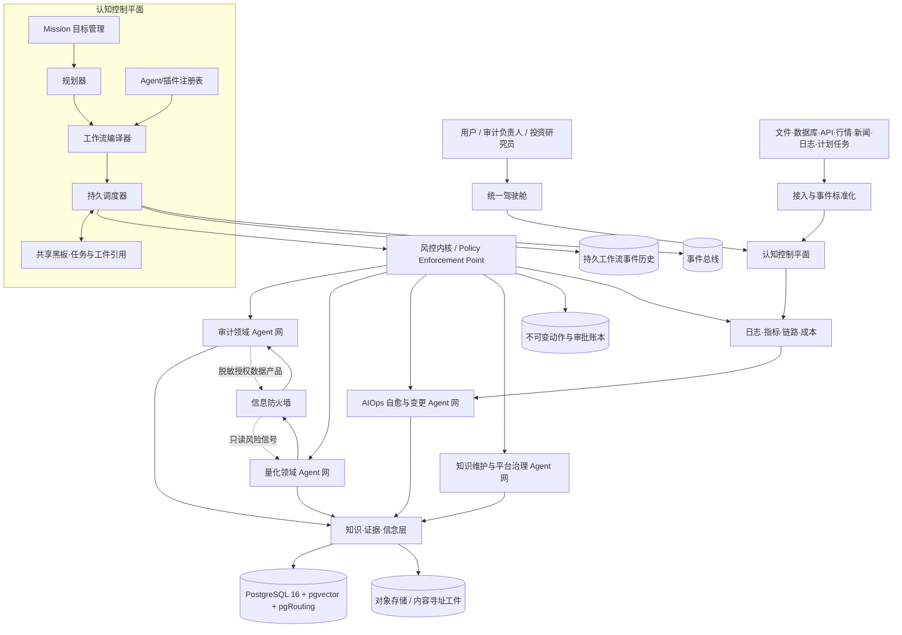

# 超级审计、量化与 AIOps 智能中枢总体设计

> 版本：0.9 架构蓝图  
> 日期：2026-09-02  
> 定位：长期自治运行的审计大脑、量化大脑、智能运维大脑、插件组网与子 Agent 调度中枢，并以严格信息防火墙连接审计、市场研究、组合风控和系统自愈。

## 0. 结论先行

本系统不应做成一个拥有所有权限、所有上下文和所有工具的“万能 Agent”，而应采用：

**一个可靠中枢 + 三个专业领域脑 + 一个确定性风控内核 + 一套可插拔 Agent/工具网络。**

- **可靠中枢（Cognitive Control Plane）**：接收目标、拆解任务、编译工作流、分发子 Agent、持久化运行状态、失败恢复和资源调度。
- **审计脑（Audit Brain）**：持续接入账务、凭证、合同、代码、日志、制度和外部情报，执行控制测试、异常检测、关联方分析、证据归集和底稿生成。
- **量化脑（Quant Brain）**：接入市场与财务数据，执行数据质检、因子研究、回测、信号生成、组合监控和风控复盘。
- **智能运维脑（AIOps Brain）**：持续接入指标、日志、链路、部署、CMDB、队列和模型服务状态，执行告警收敛、根因分析、修复提案、自动审批、自愈验证和回滚。
- **风控内核（Risk Kernel）**：位于所有工具调用之前，以白名单、黑名单、权限、路径、数据分类、动作副作用和风险预算作确定性判定；审核 Agent 只处理规则覆盖不到的灰区。
- **信息防火墙（Information Barrier）**：审计客户的非公开信息不得进入交易信号、回测样本或下单链路；跨域只允许传递经过脱敏、授权且标记用途的数据产品。

所谓“24 小时 Agent 干活”，不是让昂贵 LLM 永久占用进程，而是让**事件监听器、定时器和持久工作流 24×7 在线**；事件到达时按需唤醒短生命周期 Agent，完成后释放模型和算力。

## 1. 从现有系统和参考项目继承什么

### 1.1 从“知音预测”继承的工程能力

- 引擎与 UI 解耦，所有能力经统一类型契约暴露。
- 本地优先，云端模型与本地模型可替换、可降级。
- 规则知识骨架 + LLM 增量抽取，不把结构化事实完全交给模型。
- 向量、关键词和图谱混合检索；大语料入数据库，小配置留内存。
- 实体 ID 命名空间化、同步有明确依赖顺序、批处理避免 O(n²)。
- 冒烟测试验证领域不变量，而不只是验证“能运行”。
- 图表、模型、向量服务异常不得拖死主进程；重任务必须异步、限流和可恢复。

### 1.2 从量化回测平台继承的闭环

- “研究管线”和“生产引擎”双轨，但共享同一份版本化因子定义。
- 因子口径、数据单位和点时数据必须通过一致性测试。
- 数据同步 → 质量闸门 → 因子计算 → 选股/信号 → 回测 → 跟踪 → 复盘形成闭环。
- 数据新鲜度、未来函数、幸存者偏差、复权、交易成本和风格漂移属于第一等风险。
- 短期跑输不直接等于模型失效，需用预先定义的失效判据与滚动窗口判断。

### 1.3 从本地参考项目继承的能力

| 参考项目 | 借鉴内容 | 不直接照搬的部分 |
|---|---|---|
| Hound | Coverage/Sweep 广覆盖、Intuition 深挖、假设—证据—置信度、独立 QA、会话续跑 | 仅靠自由式 Agent 循环不足以承担生产调度和高风险动作 |
| nextclaw | PG 多 schema、四层召回、八路混合检索、Agent 隔离、确定性隐私策略、自调优提案与自动回滚 | 不把 UNLOGGED 缓存或单一 PG 通知当作全部消息基础设施 |
| PM-OS Brain | 事件溯源、规范实体解析、关系质量审计、过期衰减、外部 enrichers | Markdown frontmatter 适合知识资产，不适合作为高并发运行状态主库 |
| EnterpriseIQ | FastAPI + Web GUI + 图谱/RAG/预测/异常工作台 | 演示型预测和简单标准差异常不能直接作为审计或投资结论 |
| KG-GNN 审计 | 关联方交易图、时序异构边、异常路径和隐含关系挖掘 | GNN 只能作为候选发现器，不能替代可解释证据和规则复核 |
| Multi-Agent AIOps | 事件驱动、状态机、异常投票、拓扑 RCA、Playbook、爆炸半径、熔断和分级自愈 | 示例中 L0 可能先执行后审批、dry-run 仅格式化命令、检查点与审计日志在内存，生产中必须重构 |

### 1.4 从 DeepSeek Harness 权限机制继承的能力

- 把**沙箱范围**与**审批策略**拆成两个独立旋钮，再组合为具名权限预设。
- 每个会话的权限选择写入持久事件，重启后可回放重建。
- 审批结果是闭合词汇；缺少审核者、审核异常或无法判定时不能默默放行。
- 审批请求与审批结果成对写入审计日志。
- 权限改变只影响后续动作，不能篡改之前的执行历史。

本项目在此基础上扩展 `auto` 策略，使机器规则和审核 Agent 可以代替逐次人工弹窗。


数据库密码：| 项     | 默认                     | 环境变量                          |
| ----- | ---------------------- | ----------------------------- |
| 库名    | 自己新建数据库
| 用户    | `postgres`        
| 密码    | `admin`              
| 主机/端口 | `localhost:5432`      

## 2. 总体架构



### 2.1 四类平面必须分开

1. **控制平面**：决定做什么、由谁做、何时做，不直接处理大数据。
2. **数据平面**：插件和 Agent 读取数据、计算和产出工件。
3. **策略平面**：决定某个动作能否执行，独立于 LLM 的意愿。
4. **观测平面**：记录发生了什么、花费多少、是否异常、如何回放。

## 3. 自治模式、审批模式与白黑名单

### 3.1 权限预设

| 模式 | 文件/进程范围 | 审批策略 | 适用场景 |
|---|---|---|---|
| `READ_ONLY` | 只读 | 无需审批；写操作拒绝 | 调研、知识检索、审计浏览 |
| `WORKSPACE_ASK` | 仅项目工作区可写 | 灰区和副作用动作人工审批 | 默认开发和审计底稿整理 |
| `AUTO_GUARDED` | 可按策略扩大 | 规则自动判定，灰区交审核 Agent，关键动作交人工 | 推荐的 24×7 模式 |
| `AUTO_FULL` | 主机级完整能力 | 除不可覆盖黑名单与风险预算外自动放行 | 独立机器、已验证任务、无人值守 |
| `LOCKDOWN` | 全部只读或停止 | 全拒绝 | 事故响应、维护、紧急停机 |

`AUTO_FULL` 的“完全放开”表示**不逐步弹窗、不使用固定工作区沙箱限制**，但仍保留三条不可绕过的底线：

1. 命中不可覆盖黑名单直接拒绝；
2. 超出财务、数据泄露、删除范围或资源预算时暂停；
3. 每个动作必须有身份、输入、规则版本、决定和结果记录。

### 3.2 三层判定链

```text
工具调用提案
  → 规范化与解析（程序、argv、PowerShell AST、路径、URL、SQL AST、Git 目标）
  → 硬黑名单（不可被审核 Agent 覆盖）
  → 精确白名单/授权租约（直接放行）
  → 能力与风险规则（allow / deny / review）
  → 审核 Agent 对灰区给出结构化建议
  → 必要时人工一次性/本会话/永久授权
  → 执行器再次校验参数哈希，执行并记录结果
```

### 3.3 为什么不能只做字符串匹配

单纯判断命令是否以 `git`、`python` 或 `powershell` 开头很容易被绕过。策略引擎必须先解析：

- 可执行文件解析后的绝对路径和签名/哈希；
- shell 嵌套、管道、重定向、命令替换、编码命令和下载后执行；
- 文件目标解析后的真实路径，处理 `..`、符号链接、硬链接和通配符；
- SQL 语法树，区分只读查询、DDL、DML 和跨租户访问；
- HTTP 的域名、IP、重定向最终地址、方法、上传内容级别；
- Git 的远端、分支、是否强推、是否删除分支、是否包含敏感文件；
- 工具调用声明的副作用与实际执行计划是否一致。

白名单/黑名单仍是用户主要配置界面，但底层执行的是结构化规则，而非模糊文本猜测。

### 3.4 策略优先级

```text
系统不可覆盖拒绝
  > 租户/领域黑名单
  > 项目黑名单
  > 临时事故规则
  > 精确一次性授权
  > 项目/Agent/工具/命令白名单
  > 风险分类默认策略
  > 模式默认值
```

冲突时拒绝优先；规则无法解析时进入 `review`，不能把“无法识别”当作“安全”。

### 3.5 策略示例

```yaml
policy_set:
  id: workstation-auto-v1
  mode: AUTO_GUARDED
  scope:
    project: D:/pythonpro/audit_network

  allow:
    - id: tests-in-workspace
      capability: process.execute
      executable_hash: "sha256:..."
      argv:
        command: "pytest"
        args_regex: "^[A-Za-z0-9_./:-]+$"
      filesystem:
        write_roots: ["D:/pythonpro/audit_network/.tmp", "D:/pythonpro/audit_network/reports"]
      network: deny

    - id: approved-market-read
      capability: http.request
      methods: [GET]
      domains: ["qt.gtimg.cn", "hq.sinajs.cn"]
      data_classification: public

  deny:
    - id: broad-recursive-delete
      capability: filesystem.delete
      recursive: true
      path_roots: ["C:/", "D:/", "C:/Users/he", "D:/pythonpro"]
      overridable: false

    - id: secret-egress
      capability: http.request
      body_contains_classification: [secret, audit_confidential, mnpi]
      overridable: false

    - id: live-order-by-llm
      capability: broker.order.submit
      actor_type: llm_agent
      overridable: false

  review:
    - capability: process.execute
      when: "unknown_executable or shell_nesting > 1 or network_and_write"
      reviewer: risk-review-agent
      human_if_score_gte: 80
```

### 3.6 审核 Agent 输出契约

审核 Agent 不能输出自由文本“看起来没问题”就放行，必须返回：

```json
{
  "decision": "allow_once | allow_lease | deny | human_review",
  "risk_score": 0,
  "risk_types": ["filesystem_write", "network_egress"],
  "matched_rules": ["R-102", "R-205"],
  "normalized_effects": [],
  "reason": "",
  "lease_constraints": {
    "expires_at": "",
    "max_calls": 1,
    "argument_hash": "",
    "path_roots": []
  }
}
```

执行器只接受由策略服务签名的授权票据；Agent 自己生成的“已批准”文本无效。

## 4. Agent 与插件组网

### 4.1 Agent 不等于插件

- **插件**是确定性能力单元：连接器、解析器、规则、模型、图算法、报告器、执行器。
- **Agent**是带目标、角色、短期上下文和有限工具集的决策者。
- **工作流**是经过验证的任务图。
- **Mission** 是用户的高层目标和完成标准。

Agent 只能通过已注册插件执行动作；插件不直接信任 Agent 的文字说明。

### 4.2 核心 Agent 角色

| Agent | 主要职责 | 默认权限 |
|---|---|---|
| 总控/规划 Agent | 目标澄清、任务分解、选择模板、提出动态工作流 | 只读注册表，不直接执行外部动作 |
| 调度监督 Agent | 监控阻塞、成本、失败和重规划建议 | 工作流控制，不接触业务秘密正文 |
| 数据管家 Agent | 数据源新鲜度、口径、血缘和质量闸门 | 数据读写，不能发布结论 |
| 审计规划 Agent | 风险评估、审计程序和样本设计 | 审计域只读/底稿草稿写 |
| 证据 Agent | 获取、哈希、解析、定位和归档证据 | 指定数据源只读 |
| 图谱 Agent | 实体对齐、关系抽取、路径和社区分析 | 知识域写入提案 |
| 规则/控制 Agent | 执行硬规则、不变量和控制测试 | 规则执行，无外部写 |
| 异常调查 Agent | 对候选异常进行多步调查和反证 | 限定范围读 |
| 审计 QA Agent | 独立复核假设、证据充分性和报告一致性 | 只读，不能修改原结论 |
| 量化研究 Agent | 因子研究、模型比较、实验设计 | 研究环境写，不能下单 |
| 回测 Agent | 点时数据校验、回测、成本和稳健性分析 | 回测环境写 |
| 组合风控 Agent | 暴露、集中度、流动性、回撤和压力测试 | 只读组合；可触发冻结建议 |
| 市场情报 Agent | 新闻、公告、宏观和事件归因 | 公开数据只读 |
| 风控审核 Agent | 审核灰区工具调用，解释策略命中 | 无执行权 |
| 监控与收敛 Agent | 指标/日志/链路异常、多算法投票、告警去重和风暴抑制 | 观测数据只读 |
| 拓扑/RCA Agent | 服务依赖、近期变更、症状传播和根因候选排序 | 拓扑与事件只读 |
| 修复规划 Agent | 从版本化 Playbook 生成修复提案、前置条件和补偿动作 | 无执行权 |
| 变更审核 Agent | 风险、爆炸半径、时段、历史成功率和 SLO 影响评估 | 无执行权 |
| 自愈执行 Agent | 持授权票据执行 canary/修复/回滚 | 受策略约束的运维权限 |
| 恢复验证 Agent | 独立验证指标、日志、链路和业务探针是否恢复 | 只读，不参与原执行决策 |
| 运维复盘 Agent | 事故时间线、根因、动作效果、Playbook 改进提案 | 复盘草稿写入 |
| 平台治理 Agent | 队列、备份、容量、模型成本和故障恢复 | 受策略约束的平台权限 |

### 4.3 插件类别

1. Source：数据库、ERP、文件、Git、网页、行情、公告、邮件等连接器。
2. Parser：OCR、PDF、表格、代码 AST、日志和合同解析。
3. Transform：清洗、归一化、实体对齐、分块、特征和因子计算。
4. Detector：规则、统计、异常检测、图算法、GNN 和模型推断。
5. Reasoner：GraphRAG、案例推理、假设管理和反证搜索。
6. Action：写文件、发消息、创建工单、调用外部系统、模拟/真实下单。
7. Sink：底稿、报告、Obsidian、对象存储、仪表盘。
8. Guard：策略、脱敏、恶意内容检测、数据泄露防护和审批。
9. UI Extension：自定义图、表、审批面板和领域工作台。

### 4.4 插件清单必须声明的契约

```yaml
id: audit.journal-entry-detector
version: 1.3.0
runtime: python
entrypoint: plugin:run
capabilities: [audit.je.detect]
inputs:
  schema: schemas/journal_entries.v2.json
outputs:
  schema: schemas/anomaly_candidates.v1.json
side_effects: none
idempotency: input_snapshot_hash
permissions:
  data_read: [audit.gl.normalized]
  data_write: [audit.candidates]
  network: none
resources:
  cpu: 2
  memory_mb: 4096
  gpu: false
timeout_seconds: 1800
retry:
  max_attempts: 2
  backoff: exponential
data_classification: audit_confidential
evidence:
  preserve_inputs: true
  code_hash_required: true
tests:
  contract: tests/contract
  golden: tests/golden
ui:
  schema_version: "1.0"
  navigation:
    - slot: workspace.tools
      title_key: audit.je.title
      icon: shield-check
      route: /plugins/audit.je-detector
  views:
    - id: candidates
      renderer: data-table
      data_source: audit.je.list_candidates
      config_schema: ui/candidates-view.schema.json
  actions:
    - id: inspect
      capability: audit.je.inspect
      placement: [table.row, detail.header]
  settings_schema: ui/settings.schema.json
  i18n: [zh-CN, en-US]
```

插件发布前必须通过：Schema 契约测试、权限测试、路径逃逸测试、幂等测试、故障注入、Golden Dataset 和资源上限测试。

### 4.5 插件化 GUI 与最大兼容性边界

GUI 采用“稳定 Shell + 插件声明 + 受控渲染器”模式。普通插件不得向主页面注入任意 JavaScript，而是通过版本化 `UIContribution` 声明菜单、页面、卡片、表格、表单、图谱、图表、动作和设置项。主框架统一负责登录态、RLS 上下文、主题、多语言、无障碍、审批、错误边界、遥测和卸载清理。

兼容性规则：

- UI 契约独立于 React、Vue 等具体框架，使用 JSON Schema/OpenAPI/标准数据协议；
- `schema_version` 使用 SemVer；主框架至少兼容当前大版本和前一个大版本，并提供迁移器；
- 插件只能使用核心注册的 `renderer`、`slot` 和设计令牌，未知字段忽略、缺失可选能力降级显示；
- GUI 动作只提交 `capability + typed arguments`，仍须经过 Policy Gateway，不能绕过白名单、黑名单和审批；
- 插件读数据只能调用声明过的查询/命令契约，不直连其他领域私有表；
- 无 GUI 的后端插件、无后端的纯视图插件和远程插件都可注册；GUI 故障不得影响插件后台任务；
- 可扩展渲染器使用 Web Component 标准；自定义前端代码仅限签名且受信任的插件，在 sandboxed iframe/独立 origin 中运行，通过版本化消息桥通信；
- 禁止插件覆盖系统审批、Risk Center、登录、审计日志和 kill switch；插件只能向预留插槽追加内容；
- 禁用/卸载插件后，导航、路由、订阅、缓存和临时授权必须完整撤销，历史工件与审计记录保留。

首批稳定插槽为 `global.navigation`、`workspace.navigation`、`workspace.tools`、`dashboard.cards`、`entity.tabs`、`detail.actions`、`settings.sections`。新增插槽只能向后兼容，不能改变旧插槽语义。

## 5. 从自然语言到可执行网络

### 5.1 编译流程

```text
自然语言目标
 → MissionSpec（范围、期限、完成标准、预算、自治模式、数据等级）
 → 规划 Agent 选择模板并补充节点
 → Capability Resolver 将能力映射到插件版本和 Agent 角色
 → Workflow Compiler 生成类型化 DAG/状态机
 → 静态检查：输入输出、环、权限、预算、数据跨域、副作用、补偿动作
 → Dry-run：只解析和估算，不产生外部副作用
 → 策略批准并签名 workflow_revision
 → 持久调度执行
 → QA/验收门判断 Mission 是否完成
```

### 5.2 允许动态组网，但不允许无约束自修改

Agent 可以提出增删节点、换模型或扩大范围的计划修订，但每次修订必须：

- 生成新的不可变工作流版本；
- 说明为什么重规划及成本变化；
- 重新经过编译器和风控内核；
- 保留旧版本和运行中间状态；
- 不能修改系统不可覆盖规则；
- 生产中的自调优先进入提案或 challenger，不直接覆盖 champion。

合同网投标可用于昂贵、异构资源的选择；普通任务优先采用确定性的能力匹配分数，减少无意义的 Agent 互相讨论。

## 6. 24×7 持久调度

### 6.1 三种基础设施职责

- **PostgreSQL**：业务事实、配置、任务索引、知识、证据元数据和策略源数据的权威存储。
- **持久工作流引擎**：保存步骤历史、定时器、重试和等待状态；进程重启后从原位置继续。建议生产采用 Temporal。
- **事件总线**：传送文件到达、数据更新、市场事件和任务结果。建议 NATS JetStream；MVP 可先用 PostgreSQL transactional outbox + worker，避免一开始引入过多服务。

Celery 可以保留为某些 Python 计算插件的短任务队列，但不作为整个大脑的唯一工作流真相来源。

### 6.2 可靠性要求

- 所有任务拥有 `mission_id/run_id/task_id/attempt/idempotency_key`。
- Worker 通过租约和心跳领取任务，失联后租约过期重派。
- 先写业务状态与 outbox，再异步发布事件，防止双写不一致。
- 消费端使用 inbox 去重；默认按“至少一次投递 + 幂等处理”设计。
- 重试区分瞬态、永久、权限、数据质量和逻辑错误。
- 失败进入 DLQ，保存输入引用、环境、插件版本和最后错误。
- 外部副作用插件必须提供补偿动作或明确声明不可补偿。
- 队列支持优先级、租户配额、Agent 配额、成本预算、背压和熔断。

### 6.3 调度优先级

```text
priority = 法定/业务期限
         + 风险严重度
         + 证据或行情时效性
         + 预计风险降低收益
         + 等待老化分
         - 预计成本
         - 当前资源压力
         - 高不确定性惩罚
```

硬约束永远先于该分数：权限、信息墙、资源上限和依赖未完成时不能调度。

## 7. 知识、证据与信念体系

### 7.1 不是一个“万能知识图谱”，而是六个相连的图

1. **业务实体图**：公司、人员、账户、合同、供应商、客户、证券、行业。
2. **数据血缘图**：来源、文件、表、字段、转换、快照、报告。
3. **插件能力图**：插件、输入输出类型、依赖、权限、替代关系和历史表现。
4. **审计风险图**：认定、风险、控制、程序、证据、发现和整改。
5. **市场因果/事件图**：公告、政策、行业、公司事件、因子和价格反应。
6. **运行图**：Mission、工作流、任务、Agent、工具调用、审批和工件。

实体必须使用命名空间，例如 `company:600519`、`audit_control:revenue_cutoff`、`plugin:audit.je-detector@1.3.0`。

### 7.2 Claim–Evidence 模型

不要把 LLM 句子直接当事实。每个结论存为 Claim：

- 内容与结构化谓词；
- 支持证据和反驳证据；
- 证据来源独立性、质量、新鲜度和适用范围；
- 生成它的插件、代码版本、模型、提示模板和输入快照；
- 当前状态：proposed / investigating / supported / contradicted / confirmed / rejected；
- 复核者和复核时间。

置信度必须拆解展示，不能把未经校准的 0.87 冒充真实概率：

```text
confidence = evidence_strength
           × source_independence
           × freshness
           × rule_consistency
           × model_calibration
```

### 7.3 证据链

所有关键报告结论都可逆向点击：

```text
报告结论
 → Claim
 → Evidence Slice
 → 原始工件 SHA-256
 → 数据快照/来源/采集时间
 → 插件版本/参数/模型/Prompt
 → 工作流与审批记录
```

原始证据进入内容寻址对象存储；元数据进入 PG；证据只追加，修订通过新版本和 supersedes 关系表达。

### 7.4 检索路线

沿用并扩展 nextclaw 的多路召回：

- 精确锚点：项目、客户、期间、科目、证券、文件、任务；
- 全文和 trigram；
- 语义向量；
- 实体与别名；
- 时间窗口；
- 数据分类和领域；
- 图多跳；
- 相似案例；
- 当前 Mission 的活动记忆。

先跑确定性便宜路线，再做向量与图扩展；最终用来源多样性和证据质量重排。

### 7.5 一键式知识工厂

用户体验应当足够简单：

1. 把 PDF、Word、Markdown、Excel、图片、代码或数据文件放入指定投递文件夹；
2. 在 GUI 点击“扫描并处理”，或开启文件夹自动监听；
3. 查看待处理文件、目标知识域、预计分块数和资源成本；
4. 点击确认后，系统自动完成解析、向量化、图谱构建、质量校验和发布；
5. 处理完成后可直接检索、问答、浏览图谱和查看来源。

建议的文件区：

```text
knowledge_drop/
  inbox/           用户投放区
    audit/         审计资料
    quant/         量化与市场资料
    aiops/         运维资料
    general/       尚未分类的通用资料
  quarantine/      恶意、加密、格式异常或无法解析的文件
  rejected/        经规则拒绝的文件及原因
  receipts/        每批导入的收据、统计和错误报告
```

系统默认不移动或改写用户原文件，而是读取后生成内容哈希和只读快照。是否归档原文件由用户配置。

一批文件的处理流水线：

```text
扫描与稳定性检测
 → 文件指纹/SHA-256/重复检测
 → 安全扫描与隔离
 → 格式识别、OCR、表格和代码解析
 → 结构感知分块
 → 文档分类与目标图谱路由
 → embedding 与全文索引
 → 实体/关系/事件/Claim 抽取
 → 实体对齐、别名和冲突发现
 → 写入 staging 知识库与影子图
 → 质量检查和检索回归测试
 → 原子发布新的 Knowledge Release
 → 索引预热、缓存刷新和处理回执
```

发布采用 staging → active 两阶段。任何步骤失败时，旧知识版本继续服务，不能出现“向量已更新但关系没更新”或“节点已写入但边因外键失败”的半成品状态。

### 7.6 多层、多图谱联邦，而不是一张无限膨胀的大图

知识图谱采用“**内部高关联、图间低耦合、元图负责导航**”的 Graph Fabric。

| 层级 | 图谱内容 | 特征 |
|---|---|---|
| L0 元图 | 图谱、领域、项目、插件、能力、数据产品和入口节点 | 小、稳定，只做路由和影响分析 |
| L1 领域图 | 审计、量化、AIOps、法规、代码、知识管理等 | 各自 ontology，禁止无意义跨域扩散 |
| L2 项目/租户图 | 某审计项目、某策略研究、某系统或某客户 | 权限和数据隔离边界 |
| L3 专题/社区图 | 收入、采购、关联方、因子、模型服务、数据库等 | 内部关系密集，是主要推理范围 |
| L4 文档/证据图 | 文档章节、表格、图片、代码位置、证据切片 | 来源精确，可随时回到原文 |

插件图位于 L0/L1：描述插件、能力、输入输出 Schema、权限、工作流、替代插件和运行质量。插件节点不直接连接海量文档节点，而是连接相应领域图的 Gateway/Collection 节点，避免插件图被业务关系淹没。

每个知识图有独立的：

- `graph_id`、ontology、版本和负责人；
- 节点与关系配额；
- 可用关系类型和最大跳数；
- 索引和缓存策略；
- 数据分类与访问策略；
- 检索质量基准和失效阈值。

图内关系可高度密集；跨图关系必须写入单独的 `bridge_edges`，只允许以下类型：

- `same_as`：经过实体对齐确认；
- `summarizes`：元图/集合对下层图的摘要；
- `exposes_capability`：插件到领域能力入口；
- `derived_from`：跨域数据产品到获准公开来源；
- `related_project`：项目层有限关联；
- `risk_signal_for`：市场/AIOps 向审计域传递的授权风险提示。

每个图对外只暴露少量 Gateway 节点。跨图桥数量、类型和方向均有配额；普通 L4 文档节点不得彼此跨图泛连。

### 7.7 防止海量图检索“炸掉”的路由与预算

任何查询都不能从全库任意节点开始无边界 BFS。检索采用：

```text
查询理解
 → L0 元图选择 1–3 个候选图
 → 各图通过锚点/全文/向量找入口节点
 → 图内带预算的局部扩展
 → 仅在证据不足时通过 Gateway 跨图
 → 合并、去重、证据质量重排
 → 生成答案和完整来源路径
```

每次图检索携带硬预算：

```yaml
graph_query_budget:
  max_graphs: 3
  max_hops_per_graph: 3
  max_frontier_per_hop: 50
  max_total_nodes: 500
  max_total_edges: 1500
  max_bridge_hops: 1
  max_latency_ms: 1500
  min_edge_confidence: 0.55
```

超过预算时不抛出导致上层 Agent 失败的异常，而是按顺序降级：

1. 停止继续扩图；
2. 使用社区/子图摘要；
3. 返回已获得的证据和 `partial=true`；
4. 建议用户或规划 Agent 缩小范围；
5. 将慢查询样本交给 Graph Optimizer Agent 产生索引/分区提案。

性能措施：

- 先向量/全文找入口，再图遍历，不做全图扫描；
- 按 `tenant_id + graph_id + community_id` 分区；
- 为常用闭包、风险传播和插件依赖建立物化视图；
- 对热门局部子图、路径和邻居集合做版本感知缓存；
- 大社区定期运行社区发现，过大时由 Graph Partition Agent 提议拆分；
- 超级节点按关系类型、时间或项目拆成代理节点，避免单点百万邻边；
- 低置信、过期和极少使用的边降温，不进入默认扩展；
- 图算法/GNN 放在离线任务，在线检索只读取已验证结果。

### 7.8 节点与关系管理工作台

GUI 提供类似“文件管理器 + 数据表 + 图谱”的三种视图，支持：

- 按图谱、层级、实体类型、来源、置信度、时间和状态筛选；
- 新建、编辑、批量导入、批量归类、打标签和固定节点；
- 实体合并、拆分、别名管理、规范 ID 变更和重定向；
- 关系新增、改向、降权、过期、停用和来源补充；
- 一键查看节点的邻居、来源、Claim、历史版本和被哪些报告引用；
- 重复实体、孤立节点、断边、缺失逆关系、超级节点和冲突收件箱；
- 对比两个节点或两个图版本的属性、关系和来源差异；
- 将节点/边移入回收站、恢复、永久保留或在保留期后清理；
- 对 Agent 提议的变更执行批准、驳回、修改和批量审批。

节点合并不会改写历史引用。旧 ID 保留为 alias/redirect，历史报告仍可回放到当时版本。

### 7.9 冲突学习、回收站和版本回滚

“冲突”不等于“旧信息一定错误”。系统先把知识表示为带时间和来源的 Assertion/Claim：

```text
实体 —[关系/属性]→ 值
  + source_artifact
  + valid_time（事实在哪段时间有效）
  + transaction_time（何时进入系统）
  + confidence
  + status
```

冲突处理状态：

```text
active → disputed → supported / superseded / rejected → trashed
```

典型例子“某公司 CEO 是 A”和“CEO 是 B”可能是任期变化，不应直接删除 A；加入 `valid_from/valid_to` 后两者可以同时成立。真正互斥且同一有效期的事实进入 Conflict Inbox。

Conflict Arbiter Agent 负责：

1. 判断是否为时间变化、别名、不同口径或真正冲突；
2. 比较来源等级、独立性、新鲜度和原文证据；
3. 主动检索第三方证据；
4. 提出保留、降权、标记争议、替代或移入回收站的 ChangeSet；
5. 高影响节点交独立 Reviewer Agent 或人工确认。

删除默认都是软删除：

- 原始证据和导入快照不可被学习 Agent 硬删除；
- 节点、关系、分块和 embedding 使用 tombstone；
- 回收站保留删除者、理由、证据、策略版本和原位置；
- 默认保留 30/90/365 天，敏感审计证据按档案政策长期保留；
- 永久清理由单独权限和保留策略控制，不能由普通自进化 Agent 触发。

### 7.10 图谱和向量知识库的版本模型

每次导入、合并、冲突处理、Agent 改进或人工编辑都生成不可变 `KnowledgeChangeSet`：

```json
{
  "changeset_id": "kcs_...",
  "parent_release": "kr_20260902_001",
  "actor": "agent:entity-resolver@2.1",
  "reason": "merge duplicate supplier identities",
  "source_batch": "ingest_...",
  "operations": [],
  "tests": [],
  "reviewers": [],
  "policy_decision": "pd_...",
  "created_at": "..."
}
```

版本分为：

- **Data Snapshot**：原始输入的不可变快照；
- **Chunk Release**：分块算法和解析结果版本；
- **Embedding Release**：模型、维度、归一化和索引参数版本；
- **Graph Release**：节点、边、ontology 和桥接边版本；
- **Knowledge Release**：把上面多个兼容版本锁定为一次可服务发布。

活动查询只读取 `active_release_id`。发布和回滚只是原子切换指针，旧版本仍可读取；大规模重向量化采用 blue/green 索引，绿色索引完成并通过检索回归测试后再切换。

支持的回滚粒度：整批文件、单个文件、单个 ChangeSet、单图、全部知识发布。回滚本身也是新事件，禁止改写历史。

### 7.11 多 Agent 协作自我进化

知识自进化采用“提案—影子环境—测试—多方复核—灰度—监控—回滚”，而不是 Agent 直接修改活动图。

| Agent | 职责 |
|---|---|
| Ingest Agent | 文件识别、批次编排和失败恢复 |
| Parser/OCR Agent | 选择解析器、评估版面和文本质量 |
| Domain Router Agent | 将内容路由到领域图、项目图和专题图 |
| Schema Agent | 提议新实体/关系类型，不能直接改生产 ontology |
| Entity Resolver Agent | 规范化、别名、去重、合并和拆分提案 |
| Relation Extractor Agent | 规则 + LLM 抽取关系和 Claim |
| Conflict Arbiter Agent | 冲突分类、取证和处置提案 |
| Graph Partition Agent | 社区发现、超级节点处理、图拆分/合并提案 |
| Quality Auditor Agent | 孤立、断边、重复、逆关系、来源和时间一致性 |
| Retrieval Evaluator Agent | 用真实问题和 Golden Queries 评测召回和答案证据 |
| Reviewer Agent | 独立复核高影响 ChangeSet，防止同一 Agent 自批 |
| Archivist Agent | 版本、回收站、保留和可恢复性检查 |

自我进化信号来自：

- 用户对答案、节点和冲突处理的反馈；
- Agent 任务成功/失败及后续 QA 结果；
- 无结果查询、慢查询和跨图过度扩散；
- 被频繁共同召回的实体和关系；
- 长期未使用、来源过期或频繁导致误报的边；
- 审计发现确认、量化模型复盘和 AIOps 事故验证结果。

只有“低风险、可逆、验证充分”的变更可自动晋级，例如补充别名、缓存调整、低影响边降温。ontology 变化、跨图桥、实体合并、证据删除和高影响冲突处置必须由独立 Reviewer 或人工批准。

### 7.12 知识系统健康指标

| 类别 | 核心指标 |
|---|---|
| 导入 | 成功率、重复率、OCR/解析质量、每批耗时、失败可恢复率 |
| 检索 | Golden Query Recall@K、MRR、答案证据覆盖、P50/P95/P99 延迟 |
| 图规模 | 每图节点/边、社区大小、超级节点数、跨图边比例、默认扩展规模 |
| 图质量 | 重复实体、孤立节点、断边、缺失逆关系、无来源边、过期边 |
| 冲突 | 未解决冲突、误删率、恢复率、仲裁后被推翻率 |
| 版本 | 发布成功率、回滚耗时、蓝绿索引一致性、旧版本可读性 |
| 进化 | 自动提案采纳率、灰度回退率、改进前后检索质量变化 |

建议硬性控制：跨图桥边占全部边的比例通常不超过 1%–3%；超过阈值时禁止自动新增桥接边并触发图谱治理任务。

## 8. PostgreSQL 逻辑分区

建议在 PostgreSQL 16 中按 schema 划分责任，而不是把所有表放到 `public`：

| Schema | 主要内容 |
|---|---|
| `iam` | 用户、角色、服务身份、Agent 身份、租户、密钥引用 |
| `policy` | 权限预设、白名单、黑名单、规则版本、授权租约 |
| `catalog` | 插件、版本、能力、Schema、运行时和健康度 |
| `control` | Mission、工作流定义、版本、运行、任务、租约 |
| `event` | outbox、inbox、领域事件索引、幂等键 |
| `artifact` | 工件、内容哈希、对象存储 URI、血缘 |
| `semantic` | 文档、分块、embedding、全文索引 |
| `graph` | 图空间、层级、实体、关系、桥接边、别名、社区、关系事件、图质量 |
| `belief` | Claim、证据链接、反证、置信分解、决定 |
| `knowledge` | 导入批次、ChangeSet、Release、活动版本、回收站和冲突工单 |
| `audit` | 项目、认定、风险、控制、程序、样本、发现、底稿 |
| `quant` | 数据集、因子版本、实验、回测、信号、组合、绩效 |
| `aiops` | 服务、拓扑、SLO、告警、事故、变更、Playbook、执行和恢复验证 |
| `risk` | 限额、评估、冻结、事故、压力场景、审批 |
| `ops` | 心跳、SLO、成本、模型调用、备份和容量 |

使用行级安全按 `tenant_id/domain_id/project_id/agent_id` 隔离；表所有者不供业务连接使用，避免绕过 RLS。敏感列采用应用层信封加密，密钥不进入 Prompt。

pgvector 初期统一使用不超过 2,000 维的 `vector`，减少兼容性和内存压力。若需要 2,560/4,000 维，可评估 `halfvec` HNSW，但必须先做召回率、索引大小和延迟基准；4,096 维仍不能直接使用当前 `halfvec` HNSW 上限。

## 9. 审计脑的持续运行闭环

### 9.1 标准持续审计工作流

```text
数据/代码/制度变更事件
 → 采集与快照
 → 数据质量与完整性校验
 → 实体对齐和血缘登记
 → Sweep 全覆盖测试
 → 风险评分与异常候选
 → Intuition 深挖高价值路径
 → 反证搜索
 → 独立 QA
 → 人工复核/自动归档
 → 底稿、发现、整改任务
 → 后续跟踪与知识更新
```

### 9.2 首批审计插件包

- 总账与日记账异常：Benford 仅作辅助、整额、周末、期末、异常用户、异常组合、重复和冲销。
- 三单匹配：采购订单、收货、发票、付款。
- 收入截止和贷后开票/退货。
- 关联方与资金闭环：企业、人员、地址、电话、银行账户和交易图。
- 供应商/客户集中度、异常新增和利益冲突。
- 合同条款、印章、发票和凭证 OCR/RAG。
- IT 审计：代码依赖、权限、配置漂移、日志、变更和高危命令。
- 控制持续监控：控制频率、例外、整改逾期和失效传播。

GNN、LLM 和异常模型只负责发现候选；确认审计发现必须经过规则、原始证据和独立 QA。

## 10. 量化脑和市场风控闭环

### 10.1 标准量化工作流

```text
行情/财务/公告更新
 → 数据新鲜度与公司行动校验
 → 点时数据快照
 → 因子与特征计算
 → 研究/生产一致性检查
 → 回测与滚动样本外验证
 → 信号候选
 → 组合和风险预算
 → 模拟盘
 → 绩效归因、漂移和复盘
 → champion/challenger 晋级或回退
```

### 10.2 四道风险闸门

1. **数据闸门**：新鲜度、缺失、单位、复权、交易日、财报可得时间和异常值。
2. **模型闸门**：未来函数、过拟合、参数稳定性、样本外、成本敏感性和风格暴露。
3. **组合闸门**：单票/行业/风格集中、流动性、换手、回撤、杠杆和压力测试。
4. **执行闸门**：市场状态、价格偏离、限价、单笔/单日限额、重复订单和 kill switch。

### 10.3 LLM 与交易执行的边界

- LLM 可以解释新闻、提出研究假设、生成实验和总结风险。
- 确定性引擎计算因子、仓位、限额和订单参数。
- 在系统成熟前只支持研究和模拟盘。
- 如未来接真实交易，LLM 不持有 broker 凭证，也不能直接调用 `submit_order`；它只能提交结构化订单提案，由独立 OMS/Risk Engine 校验和签名。
- `AUTO_FULL` 也不能覆盖单日亏损、总敞口、重复订单、MNPI 和紧急停止等硬规则。

## 11. AIOps 智能运维脑

### 11.1 AIOps 不是附属监控，而是系统的免疫与自愈层

AIOps 同时监控：

- 中枢自身：API、工作流、事件总线、数据库、对象存储、策略服务和 GUI；
- Agent Runtime：任务积压、心跳、工具失败、上下文膨胀、模型限流和异常成本；
- 审计域：数据摄入、OCR、规则、图谱、底稿和证据存储；
- 量化域：行情新鲜度、因子计算、回测、风控、模拟盘和未来 OMS；
- 基础设施：CPU、GPU、内存、磁盘、网络、Windows 服务、容器和外部依赖。

### 11.2 正确的事故处理顺序

```text
观测事件
 → 告警去重/聚合/抑制
 → 多算法异常确认
 → Incident 创建与 SLO 影响评估
 → 拓扑 + 近期变更 + 历史案例 RCA
 → 根因候选与置信分解
 → 修复 Playbook 提案
 → 真实 preflight/dry-run
 → 风控内核与变更审批
 → 小范围 canary
 → 正式执行
 → 独立恢复验证
 → 未恢复则自动补偿/回滚/升级人工
 → 事故复盘、知识图谱和 Playbook 提案更新
```

必须保证：**审批发生在任何实际副作用之前**。修复规划 Agent、审核 Agent、执行 Agent和验证 Agent分权，不能由同一个 Agent 自提、自批、自执行、自验收。

### 11.3 AIOps 专业 Agent 网络

1. **Telemetry Agent**：统一指标、日志、链路、事件和业务探针。
2. **Alert Correlation Agent**：指纹、时间窗、拓扑和因果链聚合告警，抵抗告警风暴。
3. **Anomaly Agent**：静态阈值、EWMA、季节基线、Isolation Forest 和规则投票。
4. **Topology Agent**：维护 Service/Process/Database/Queue/Model/Plugin/Agent/Host 拓扑。
5. **RCA Agent**：反向 BFS、变更关联、因果时间约束、贝叶斯/打分和相似事故检索。
6. **Remediation Planner**：选择 Playbook，生成前置条件、执行计划、canary、回滚和验证条件。
7. **Change/Risk Agent**：解释爆炸半径、关键度、时段、历史成功率和并发变更冲突。
8. **Executor Agent**：只执行已签名授权票据中完全匹配的动作。
9. **Verifier Agent**：用执行前基线、SLO、错误预算和业务探针独立判断恢复。
10. **Postmortem Agent**：生成可追溯时间线和改进建议，但修改生产规则仍走提案/测试/审批。

### 11.4 自愈等级

| 级别 | 典型动作 | AUTO_GUARDED | AUTO_FULL |
|---|---|---|---|
| L0 观测 | 重采样、抓日志、健康探测 | 自动 | 自动 |
| L1 局部可逆 | 重启单个 worker、清理项目临时文件、切换备用只读数据源 | 白名单 + canary 后自动 | 自动 |
| L2 范围可控 | 扩缩容、限流、重建索引、滚动重启、模型降级 | 审核 Agent；超阈值人工 | 策略票据后自动 |
| L3 高影响 | 应用回滚、配置回滚、故障转移、队列重放 | 人工审批 | 仅精确白名单租约自动 |
| L4 数据/不可逆 | 删除生产数据、重置主库、覆盖证据、广域凭证轮换 | 双人审批 | 不自动；命中硬黑名单 |

等级不是按命令名固定，而是由目标环境、爆炸半径、可逆性、数据等级、服务关键度和当前事故状态共同计算。

### 11.5 真正的 dry-run / preflight

仅把命令渲染出来不算 dry-run。生产 preflight 至少包括：

- 解析命令和目标资源，确认资源存在且版本未漂移；
- 校验当前状态符合 Playbook 前置条件；
- 使用工具原生 dry-run，例如 Kubernetes server-side dry-run、SQL EXPLAIN/只读事务、Git diff；
- 计算受影响实例、请求、数据和租户，给出爆炸半径；
- 检测同时进行的变更和维护窗口；
- 预先验证回滚路径、备份/快照和权限；
- 生成待执行参数哈希，审批后禁止参数漂移。

### 11.6 修复 Playbook 契约

```yaml
id: aiops.worker.restart-one
version: 2.1.0
symptoms: [heartbeat_missing, lease_stuck]
preconditions:
  - healthy_replicas >= 2
  - active_incidents_for_service <= 1
action:
  capability: service.restart
  max_targets: 1
canary:
  target_count: 1
  observe_seconds: 120
verify:
  - heartbeat_age_seconds < 30
  - error_rate_5m <= baseline.error_rate_5m * 1.2
  - queue_lag_decreasing == true
rollback:
  capability: service.restore_previous
timeout_seconds: 300
cooldown_seconds: 900
max_attempts_per_hour: 2
owner: platform-sre
```

Playbook 必须版本化、签名并配 Golden Incident、故障注入和回滚测试。自由生成的 shell 命令不能直接晋级 L1/L2 自动修复。

### 11.7 自监控与避免“看门狗一起死”

- AIOps 主链路使用 OpenTelemetry，但保留独立的最小外部 watchdog。
- watchdog 只检查心跳、端口、磁盘和关键工作流延迟，可在主中枢失效时触发 `LOCKDOWN` 和通知。
- 策略服务、审计账本和 kill switch 不依赖被监控的同一个 Agent Runtime。
- AIOps 不能在缺少可观测性、拓扑不完整或验证探针失效时继续自动修复；此时降级为人工。
- 自动修复有全局和服务级失败预算；连续失败、效果反向或根因置信度过低时熔断。

### 11.8 AIOps 与其他领域的连接

- 审计和量化工作流把自己的 SLO、数据新鲜度、模型错误和任务延迟暴露给 AIOps。
- AIOps 可以暂停数据摄入、切换备用服务、重启 worker、降级模型或冻结工作流。
- AIOps 不能改写审计结论、量化信号、证据或风险限额；只能恢复支撑它们运行的服务。
- AIOps Incident、Change 和 Action 自动进入审计域，形成 ITGC、变更管理和操作风险证据。
- 量化数据/模型故障会自动触发交易冻结建议，不能由“修复成功”直接解除；还需量化风险闸门重新验证。

## 12. 审计域与量化域的信息防火墙

这是把审计与股市放在同一中枢时最重要的结构。

### 12.1 默认禁止

- 审计客户未公开数据 → 量化因子、回测、选股、报告或交易。
- 审计 Agent 的长期记忆 → 量化 Agent 召回。
- 同一 Agent 同时拥有审计机密读取权和下单权。
- 将审计异常作为公开市场信号，除非该事实已公开且经过来源时间验证。

### 12.2 允许的安全连接

- 公开公告、公开财报、公开监管处罚可被两域各自摄入。
- 市场价格异常、舆情和公告变化可向审计域发出“风险关注事件”。
- 审计域可以输出匿名化行业控制风险统计，不含客户可识别或未公开信息。
- 跨域数据产品必须有 `classification/publication_time/legal_basis/purpose/expiry`。

知音预测中的玄学/预测算法若保留，只能作为 `experimental_non_evidentiary` 插件：可以用于 UI 演示或假设生成，权重固定为零，不得参与审计结论、组合风险、交易信号或自动执行。

## 13. GUI：统一驾驶舱

### 13.1 十一个核心工作台

1. **Mission Center**：目标、运行模式、截止期、预算、完成标准。
2. **Workflow Studio**：React Flow 类型化画布、模板、版本、模拟和差异比较。
3. **Agent Fleet**：Agent 状态、租约、上下文、工具、成本、暂停和接管。
4. **Plugin Registry**：插件版本、能力、权限、测试、健康和替代插件。
5. **Approval & Policy Center**：权限预设、白名单/黑名单、规则模拟、命中记录和授权租约。
6. **Audit Workbench**：风险、控制、程序、样本、证据、发现、底稿和复核。
7. **Quant Lab**：因子、实验、回测、信号、归因、漂移和模拟盘。
8. **Knowledge Factory & Graph Manager**：投递文件、一键处理、多图路由、实体关系、冲突收件箱、ChangeSet、回收站、版本发布与回滚。
9. **AIOps & Incident Center**：告警聚合、拓扑、RCA、Playbook、canary、执行、验证、回滚和复盘。
10. **Risk Center**：审计风险、模型风险、组合风险、操作风险、事故和 kill switch。
11. **Operations**：队列、工作流、日志、指标、链路、模型成本、容量、备份和恢复。

### 13.2 插件 GUI 运行方式

统一驾驶舱只内置 Shell、核心工作台和通用渲染器。Plugin Registry 在启用插件时读取其 `UIContribution`，校验签名、UI Schema 版本、插槽、数据源、动作能力和权限，然后生成导航及页面。插件升级先在预览区渲染并运行契约测试；不兼容时保留旧版本或退化为通用 JSON/表格视图，不阻断后台能力。

管理员可在 GUI 中启用/禁用单个贡献项、调整允许的菜单位置和标题，但不能通过界面扩大插件声明的权限。插件界面中的所有按钮都显示对应能力、风险等级和审批结果，使 GUI 与 Agent 调用共享同一套风控语义。

### 13.3 审批面板体验

每个待审批动作显示：

- Agent、Mission、工具、规范化命令和真实副作用；
- 读写路径、网络目标、数据分类、资源预算；
- 命中的白/黑/灰规则及风险解释；
- 允许一次、允许本会话、创建精确白名单、拒绝、创建黑名单；
- 授权有效期、最大次数、参数约束和撤销按钮；
- 与相似历史动作的批准/失败记录。

## 14. 现有项目的渐进接入

### 14.1 不重写现有系统，先包适配器

| 现有系统 | 第一阶段接法 | 后续演进 |
|---|---|---|
| `D:/pythonpro/math` 知音预测 | 以只读/实验插件封装知识检索、图谱和算法接口 | 拆出通用 Knowledge SDK；领域算法保持隔离 |
| `D:/pythonpro/聚宽-local` | 封装数据新鲜度、同步、因子、回测、日报插件 | SQLite 继续作源库，逐步双写/快照到 PG |
| `cankao/muellerberndt-hound` | 先作为代码审计子流程，通过工件接口输出图、假设和报告 | 将 Sweep/Intuition/QA 抽成通用审计模板 |
| `cankao/feamando-brain` | 复用关系审计、衰减和规范实体思想 | 移植为 PG 图质量 worker |
| `cankao/NextAgentBC-nextclaw` | 复用 schema 分层、检索和 Agent 隔离模式 | 将召回作为统一 Knowledge Service |
| EnterpriseIQ / KG-GNN | 作为 GUI、异常和图模型实验基线 | 通过 Golden Dataset 后再晋级生产插件 |
| `D:/pythonpro/20260830项目/multi-agent-aiops-main/multi-agent-aiops-main` | 复用四 Agent 分工、状态机、事件、拓扑和 Playbook 设计 | 纠正先执行后审批；检查点、风险、审计、dry-run 和回滚全部生产化 |

### 14.2 统一适配器接口

现有系统先通过进程/API 插件接入，返回标准 `ArtifactRef`，避免一次性迁库：

```json
{
  "artifact_id": "art_...",
  "type": "quant.backtest_result.v2",
  "uri": "object://...",
  "sha256": "...",
  "producer": "plugin:quant.local-backtest@1.0.0",
  "input_snapshot": "snap_...",
  "classification": "internal",
  "created_at": "..."
}
```

## 15. 推荐技术栈

| 能力 | 推荐 |
|---|---|
| API/控制服务 | Python 3.12 + FastAPI + Pydantic + SQLAlchemy/Alembic |
| 持久工作流 | Temporal Python SDK |
| 事件总线 | MVP：PG Outbox；规模化：NATS JetStream |
| 权威数据库 | PostgreSQL 16 + pgvector + pgRouting + pg_trgm |
| 大工件 | MinIO/S3，内容寻址和版本保留 |
| 策略引擎 | OPA/Rego 或自研结构化 PDP；工具侧为 PEP |
| Agent Runtime | 自研轻量运行时或基于 DeepSeek Harness 的扩展思路；工具通过统一 Tool Gateway |
| 前端 | React + TypeScript + React Flow + ECharts/Cytoscape.js |
| 可观测性 | OpenTelemetry + Prometheus + Grafana + Loki/Tempo |
| 本地隔离 | Windows ACL 受限令牌/Job Object；生产优先容器或独立执行节点 |
| 密钥 | Windows Credential Manager 开发；Vault/SOPS/KMS 生产 |

开发阶段默认使用本机原生 PostgreSQL 16 + pgvector 和 Windows 服务，不要求 Docker。Docker Compose 仅作为可选环境适配器；当并发、容灾和执行节点数量证明需要时，再迁移到容器或独立执行节点。数据库、迁移和应用代码不得依赖具体部署方式。

## 16. 分阶段路线图

### Phase 0：契约与威胁模型（2 周）

- 定义 Mission、Task、Artifact、Claim、Evidence、Plugin Manifest、Policy Decision Schema。
- 定义 GraphSpace、Gateway、BridgeEdge、KnowledgeChangeSet、KnowledgeRelease、ConflictCase 和 Tombstone Schema。
- 建立数据分类、信息墙、权限预设和不可覆盖黑名单。
- 明确知识检索、审计、量化和 AIOps 首个纵向场景及 Golden Dataset/Golden Queries。

验收：所有关键对象有版本化 JSON Schema；10 个高风险动作可被规则模拟器正确分类。

### Phase 1：可运行骨架（4–6 周）

- FastAPI 控制平面、PG schema、插件注册表、工作流编译器、基本 GUI。
- PG outbox worker、任务租约、心跳、幂等、重试和工件存储。
- `READ_ONLY / WORKSPACE_ASK / AUTO_GUARDED / AUTO_FULL / LOCKDOWN`。
- 完成投递文件夹 + GUI 一键导入：PDF/MD/Word/Excel/图片 → staging → 向量库 + 单领域图 → 原子发布。
- 完成基础节点管理、来源查看、软删除回收站和整批导入回滚。
- 接入一个审计流程和量化数据新鲜度/回测流程。
- 接入一个 AIOps 纵向流程：worker 心跳异常 → RCA → 修复提案 → 审批 → canary 重启 → 验证。

验收：服务重启后任务续跑；重复投递不产生重复副作用；每个动作可追溯。

### Phase 2：认知与证据（6–8 周）

- 多层多图 Graph Fabric、路由优先检索、查询预算、桥接边、混合检索和版本感知缓存。
- Claim–Evidence、冲突收件箱、实体合并/拆分、ChangeSet、蓝绿向量索引和独立 QA。
- Hound Sweep/Intuition 模板、关联方图和审计底稿工作台。
- 量化研究/生产一致性、漂移和模拟盘风控。

验收：随机抽取报告结论可 100% 回溯到原始证据和运行版本。

### Phase 3：24×7 加固（6–10 周）

- 引入 Temporal、NATS、OpenTelemetry、容量和成本治理。
- 断电/进程崩溃/网络中断/模型限流/插件 OOM 故障注入。
- 备份恢复、DLQ、回放、策略热更新、kill switch。

验收：核心流程恢复点目标 RPO≤5 分钟、RTO≤30 分钟；无人值守 14 天无任务静默丢失。

### Phase 4：受控自治与自优化

- 审核 Agent、授权租约、策略学习提案。
- 图谱分区、冲突仲裁、检索评测和 Archivist 多 Agent 自进化闭环。
- champion/challenger、沙箱预演、24h 监控和自动回滚。
- 逐类提高自动放行覆盖率，而不是一次性取消所有边界。

验收：已知安全动作自动放行率 >95%，误放行率为 0，灰区升级准确率持续可测。

## 17. 第一版 MVP 的明确边界

第一版只做五个纵向闭环：

1. **代码/插件持续审计**：Git 变更 → Hound Sweep → 深挖 → QA → 报告。
2. **财务数据持续审计**：总账导入 → 质量 → 异常 → 证据 → 底稿草稿。
3. **量化健康监控**：数据同步 → 新鲜度 → 因子一致性 → 回测/漂移 → 模拟盘风险报告。
4. **AIOps 自愈**：告警收敛 → 拓扑/变更 RCA → Playbook → 策略审批 → canary → 恢复验证/回滚。
5. **知识工厂**：文件投递 → 一键解析/向量化/图谱抽取 → staging 验证 → 发布 → 节点治理/回收站/版本回滚。

第一版不做：真实自动下单、跨客户知识共享、让 Agent 自行安装未签名插件、让 LLM 修改不可覆盖策略、把知音预测结果用于审计或投资。

## 18. 关键 SLO 与治理指标

| 类别 | 指标 |
|---|---|
| 可靠性 | 任务静默丢失数=0；重复副作用数=0；恢复成功率 |
| 审计质量 | 结论证据可追溯率；QA 驳回率；误报/漏报；覆盖率 |
| 量化质量 | 点时数据违规数=0；样本外表现；成本后收益；漂移告警准确率 |
| 自治性 | 自动放行率；人工审批次数；灰区比例；授权租约复用率 |
| AIOps | MTTD、MTTA、MTTR；告警压缩率；RCA Top-3 命中率；修复成功率；自动回滚率；自愈误伤数=0 |
| 安全性 | 黑名单拦截数；越权尝试；敏感数据外泄数=0；kill switch 延迟 |
| 知识质量 | Golden Query Recall@K；P95 检索延迟；孤立/重复/超级节点；跨图桥比例；冲突积压；误删率；发布与回滚成功率 |
| 成本 | 每 Mission token/算力/存储；缓存命中；高级模型调用占比 |

## 19. 最重要的架构决定

1. **Agent 提议，策略内核决定，执行器验证。**
2. **全自动不等于无日志、无边界或无停止能力。**
3. **工作流状态必须持久，不能只存在模型上下文。**
4. **证据、结论、动作和审批全部可回放。**
5. **审计机密与市场交易之间建立硬信息墙。**
6. **规则先行、模型补充；候选发现和最终确认分离。**
7. **现有知音与量化平台通过适配器接入，逐步抽取公共能力。**
8. **先完成五个可验证纵向闭环，再扩展“超级系统”的宽度。**
9. **智能运维按“提案—审批—执行—独立验证”分权，自愈失败必须可回滚并熔断。**
10. **知识采用多图联邦、路由优先和受预算遍历；任何自进化只能通过可测试、可回滚的 ChangeSet 发布。**

## 20. 参考资料

### 本地方案与知识库

- `C:/Users/he/.codex/attachments/d0622261-cd9f-4a3b-b8dd-e7025c8ff725/pasted-text.txt`
- `C:/Users/he/.codex/attachments/3740486a-dc33-4165-996e-b11c367af6e7/pasted-text.txt`
- `C:/Users/he/Documents/Obsidian Vault/项目/知音预测/项目文档.md`
- `C:/Users/he/Documents/Obsidian Vault/项目/知音预测/改bug经验反思.md`
- `C:/Users/he/Documents/Obsidian Vault/量化回测平台/项目总览.md`
- `C:/Users/he/Documents/Obsidian Vault/量化回测平台/多因子研究总结.md`
- `C:/Users/he/Documents/Obsidian Vault/量化回测平台/每日选股/复盘日志.md`

### 本地参考项目

- `D:/pythonpro/audit_network/cankao/muellerberndt-hound`
- `D:/pythonpro/audit_network/cankao/NextAgentBC-nextclaw`
- `D:/pythonpro/audit_network/cankao/feamando-brain`
- `D:/pythonpro/audit_network/cankao/rudra109-RAG-based-Enterprise-Data-Into-Actionable-Intelligence`
- `D:/pythonpro/audit_network/cankao/UHUxwPKBNh-Intelligent-Audit-Decision-Support-for-Enterprise-Related-Party-Transactions`
- `D:/pythonpro/deepseek-harness-master/docs/subsystems/approval.zh.md`
- `D:/pythonpro/deepseek-harness-master/docs/subsystems/permission-presets.zh.md`
- `D:/pythonpro/deepseek-harness-master/docs/subsystems/sandbox.zh.md`
- `D:/pythonpro/20260830项目/multi-agent-aiops-main/multi-agent-aiops-main`

### 官方技术资料

- Temporal：<https://docs.temporal.io/>
- pgvector：<https://github.com/pgvector/pgvector>
- PostgreSQL 16 Row Security：<https://www.postgresql.org/docs/16/ddl-rowsecurity.html>
- Open Policy Agent：<https://www.openpolicyagent.org/docs>
- OpenTelemetry：<https://opentelemetry.io/docs/>
