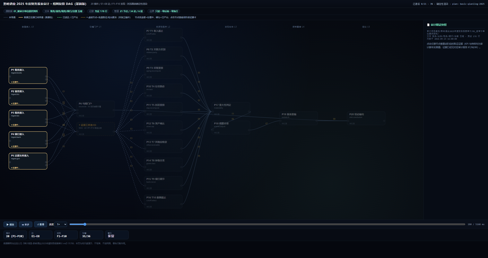
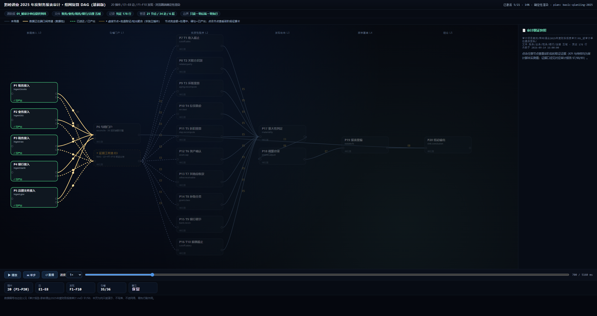
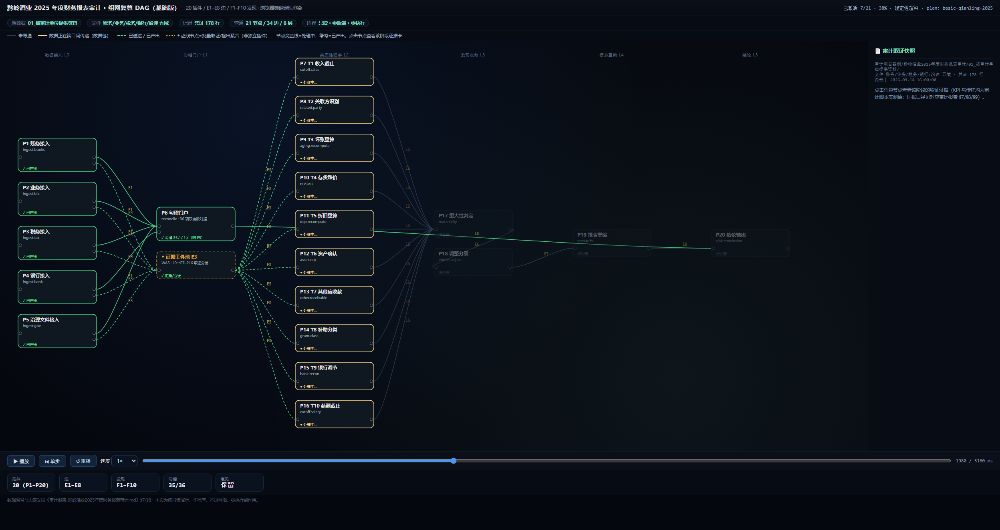
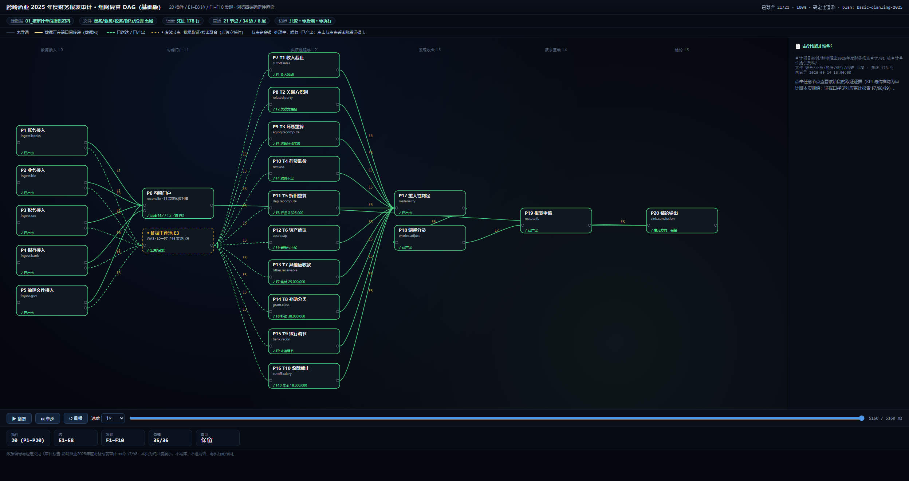
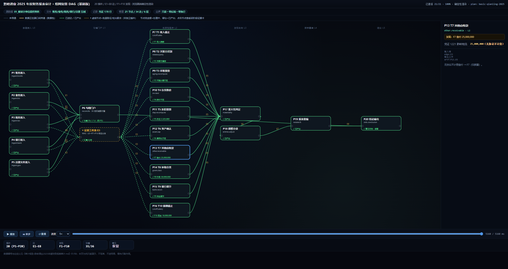
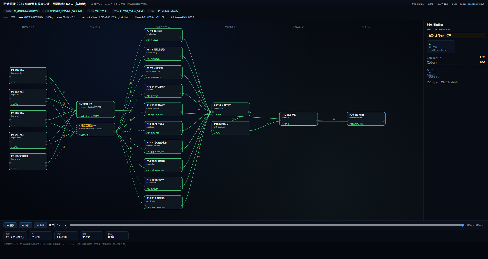

# 组网渲染流程图报告：黔岭酒业 2025 年度财务报表审计（基础版）

> 报告日期：2026-09-15
> 关联文件：[审计报告-黔岭酒业2025年度财务报表审计.md](./审计报告-黔岭酒业2025年度财务报表审计.md)（§7 插件规格 / §8 组网拓扑为本文权威依据）
> 渲染页：[`../_flow_render/index.html`](../_flow_render/index.html)（双击即可播放；无头截屏帧见 `../_flow_render/shots/`）

## 一、如何查看这幅流程图

| 操作 | 方式 | 说明 |
| --- | --- | --- |
| 播放 / 暂停 | 左下角 `⏸ 暂停` / `▶ 播放` | 数据自 L0 接入向 L5 结论单向流动 |
| 单步 | `⏭ 单步` | 每步推进到下一层节点激活边界 |
| 重播 / 速度 | `↺ 重播`、速度 0.5×–4× | 复看任意阶段 |
| 拖动时间轴 | 底部拖动条 | 任意时刻照片；`#t=毫秒` 可直接定位 |
| 节点证据卡 | 点击任意节点 | 右侧面板展示该阶段 KPI、传样与证据口径 |
| 图例 | 顶部说明条 | 灰=未导通、金=数据包传递、绿=已产出、◆虚线=批量取证聚合节点 |

## 二、组网拓扑总览（对应审计报告 §7/§8）

| 维度 | 数值 | 说明 |
| --- | --- | --- |
| 分层 | 6 层（L0 接入 → L1 勾稽门户 → L2 实质性程序 → L3 发现收敛 → L4 报表重编 → L5 结论） | 严格单向、无回边，DAG 成立 |
| 插件节点 | 20 个（P1–P20） | 与报告 §7 全量对应 |
| 边 | E1–E8（图中 34 条带标签边） | 层间按 E# 聚合标注，E3 经"证据工件池"虚拟节点批量分发 |
| 发现 | F1–F10（10 项） | 由 P7–P16 十个实质性程序逐项产出，标在节点上 |
| 关键结果 | 勾稽 35✓/1✗、重大错报 5 项、调整 7 组、审定报表 17 行、意见保留 | 与报告 §0/§6 一致 |

- **宽扇入**：L0 五域（账务/业务/税务/银行/治理）→ P6 勾稽门户，36 项双读数对撞；
- **并行分叉**：L2 十个实质性程序无内部依赖、同时激活（T1–T10 → F1–F10）；
- **单点收敛**：L3 P17（重大性判定）→ P18（调整分录）→ L4 P19（报表重编）→ L5 P20（结论）；
- **只读血缘**：全部边均为读取+引用，无写源、无外部调用（审计报告 §8.3）。

## 三、逐帧渲染截图与解释

以下 6 帧均为从渲染页按时间轴定位后的确定性截屏（同一时间应得到完全相同的画面）。

### 帧 1/6 · 组网初始：L0 接入层处理中（t≈180 ms）

- **画面**：左侧 L0 五个接入节点（P1 账务 / P2 业务 / P3 税务 / P4 银行 / P5 治理）高亮为"处理中"，右侧尚未亮起；
- **解释**：接入层正在把 01–06 目录的原始文件读成行式工件（科目余额表×3、凭证 178 行、14 个业务明细、4 张税务表、31 行日记账等），金额统一 Decimal 标准化；
- **对应报告**：§7 P1–P5 接入件；§9 数据样貌。

### 帧 2/6 · 数据包在端口间传递（t≈700 ms）

- **画面**：金色数据点沿 L0→P6（E1/E2）与 L0→证据工件池（E3）的连线上流动，L1 尚未激活；
- **解释**：账务/业务/治理工件（E1）、银行工件（E2）正在送入勾稽门户；同时各域证据工件经 E3 向 L2 十个程序分发；
- **对应报告**：§8.2 E1/E2/E3 连线明细。

### 帧 3/6 · 实质性程序并行处理中（t≈1980 ms）

- **画面**：L2 十个实质性程序（P7 T1 收入截止 … P16 T10 薪酬截止）同时点亮为"处理中"，P6 与证据池已绿色"已产出"；
- **解释**：T1–T10 十个发现程序彼此独立并行（无内部依赖）；节点下方状态行显示各自产出 F1–F10；
- **对应报告**：§7 P7–P16；§8.3"L2 十个程序完全并行分叉"。

### 帧 4/6 · 全链路导通（t≈5310 ms，结束态）

- **画面**：全图节点绿色"已产出"，边变为绿色虚线"已送达"；P6→（E5）P17 重大性判定→ P18 调整分录→ P19 报表重编→ P20 结论全部导通；
- **解释**：读出关键结果：重大错报 5 项（金额≥21,400,000）、7 组调整分录（F2/F7/F9 仅披露）、审定利润表 17 行、意见方向"保留"；
- **对应报告**：§0 结论摘要、§6 结论。

### 帧 5/6 · 节点证据卡：P13（T7 其他应收款 → F7）

- **画面**：点击 P13 后节点蓝色高亮，右侧面板展示证据卡；
- **证据卡内容**：`发现：F7 垫付 25,000,000`；输入行 `凭证 1221 黔岭物流 25,000,000（无协议不计息）`；说明"无协议不计息垫付 → F7（仅披露）"；
- **解释**：这是"可追溯"的体现——F7 可直接回溯到凭证 1221 与金额，与报告 §6 发现 F7 一致；
- **对应报告**：§8.4 P13 逐插件注释（接口 `P1 凭证 1221 → P13.finding`）。

### 帧 6/6 · 节点证据卡：P20（结论输出）

- **画面**：点击 P20 结论节点，面板展示 `输出工件 _audit_digest.json`、勾稽 35✓/1✗ 汇总、意见方向"保留"；
- **解释**：L5 收口——把 P17–P19 结果与勾稽汇总合成为最终结论工件；
- **对应报告**：§8.4 P20；§6 结论。

## 四、模式设置（AI 全自动 / 人修改 + AI 微调）

渲染页顶部新增**组网模式**切换：

| 模式 | 含义 | 中间人可做什么 |
| --- | --- | --- |
| **AI 全自动**（默认） | 组网由确定性引擎生成，图表只读 | 只能查看动画、拖动时间轴、点击节点看证据卡，不能改组网 |
| **人修改 + AI 微调** | 中间人对组网做修改，AI 引擎做一致性微调 | 可增删改节点、连线、层级、参数阈值、发现与证据 |

切换方式：点击顶部分组"组网模式"下的单选钮；或直接以 URL 打开指定模式（默认 `index.html` 为 AI 全自动，追加 `#m=manual` 直接进入人工编辑态）。

**人工编辑能力（对应你的"中间人能否改组网"）**：

1. **节点与连线**：编辑工作台新增节点（ID/名称/层级/cap）、删除节点（自动清理相关连线）；点击任意图上节点进入单节点编辑，改名/换层，重命名节点 ID 时图中连线端点自动同步；新增/删除连线（自环被拒绝）。
2. **参数与阈值**：每个节点的"参数与阈值（kpi）"可增删改——值、标签、小数位（如重大性阈值、折旧差额、坏账比例）在线编辑。
3. **发现与证据**：节点"发现（finding）"与"发现与证据（rows，键值对传样）"可增删改，支持多行证据行。

**AI 微调（本地确定性规则引擎）**：运行一致性检查，扫描并提示——节点 ID 重复、连线悬空（起点/终点不存在）、自环、层级越界、非虚拟实质性程序缺 finding、参数值非法；支持"一键修复全部"（自动删除悬空/自环连线、收敛越界层级、非法参数归零）。规则引擎为纯前端确定性实现，**零后端、零网络、零执行副作用**，与渲染引擎同一约束。

**保存与导出**：全部改动先写回浏览器内存副本；点"保存草稿并刷新预览"持久化到 localStorage（按键 `audit_dag_draft_<plan>`）并按草稿整页重渲染；"导出组网 JSON"可下载 `组网-人工微调-<plan>.json`；"重置为原始组网"清除草稿回到 AI 全自动结果。

> 边界声明：编辑能力仅为**演示层的人机协同**，页面仍是纯只读演示——不写库、不触达真实基础设施；草稿仅存在本机浏览器。真实执行的修改仍须遵守项目"plan_only 模式、禁止 execute/auto 自动执行"的契约约束。

## 五、一致性核对与边界声明

| 边 | 图中画法 | 报告定义（§8.2） |
| --- | --- | --- |
| E1 / E2 | L0 五域 → P6（实线） | 账务/业务/治理工件（E1）、银行工件（E2）→ P6.reconcile |
| E3 | L0 → ◆证据工件池 → P7–P16（虚线批量边） | L0 证据工件 → 各实质性程序专属批量分发（画法以虚拟汇聚节点表达，非独立插件） |
| E4 | 未在图中绘图（P6 → 底稿_00） | 36 项勾稽结果写底稿，详见报告 §8.2 |
| E5 | P7–P16 → P17（10 条汇聚边） | 10 项发现 F1–F10 → P17.materiality |
| E6 / E7 / E8 | P17→P18、P18→P19、P19→P20（串联） | 重大标记→7 组调整→审定报表→汇总结论；另绘 P6 → P20 的"勾稽汇总"直连 |

## 五、一致性核对与边界声明

| 核对项 | 渲染页 | 审计报告 |
| --- | --- | --- |
| 插件数 | 21（P1–P20 + 1 虚拟汇聚） | 20（P1–P20） |
| 发现数 | F1–F10 | §7 F1–F10 |
| 勾稽 | 35✓/1✗ | §0 / §8.2 |

- **边界声明**：本渲染页为纯只读演示——不写库、不进网络、零执行副作用；图中所有金额与结论均为对应审计脚本实测值（见审计报告 §6 首句口径）；E4、E5 等的权威逐条定义以审计报告 §8.2 为准，本图在其上做聚合表达。