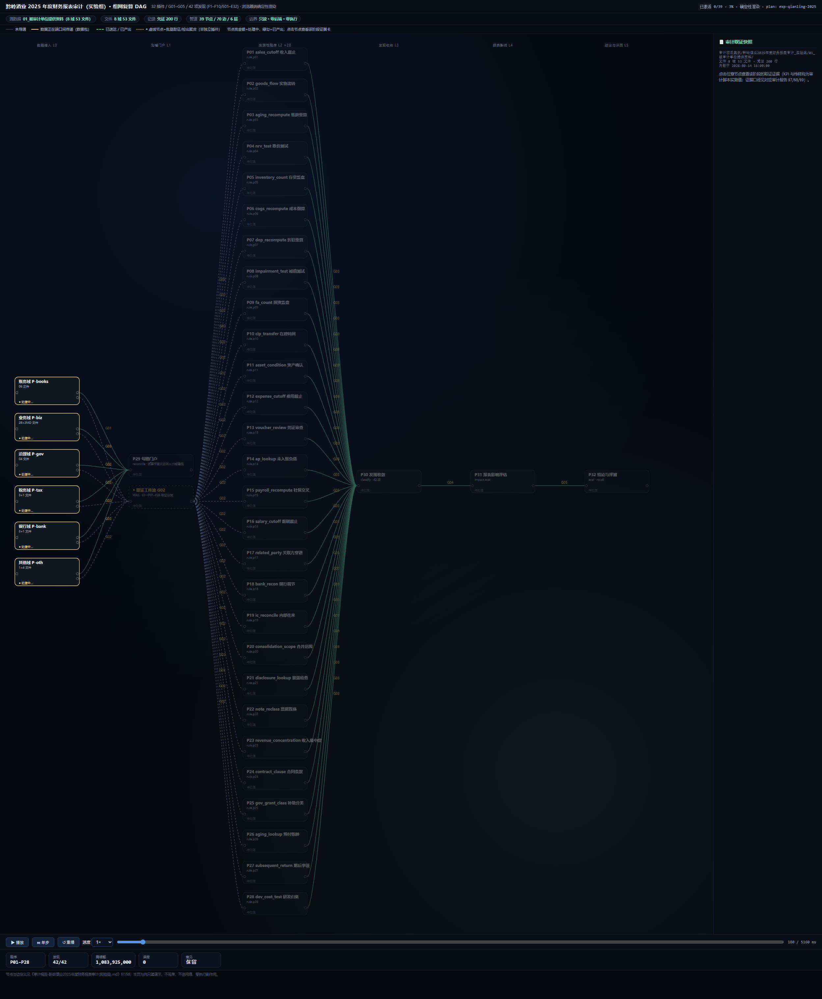
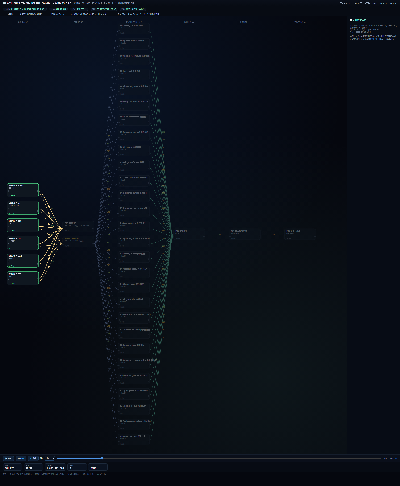
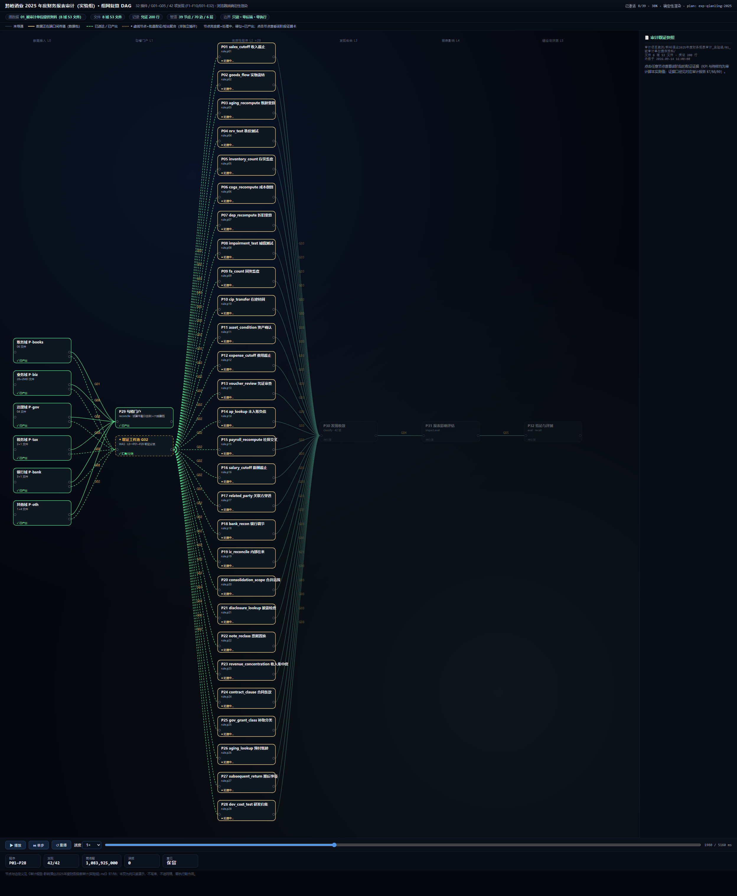
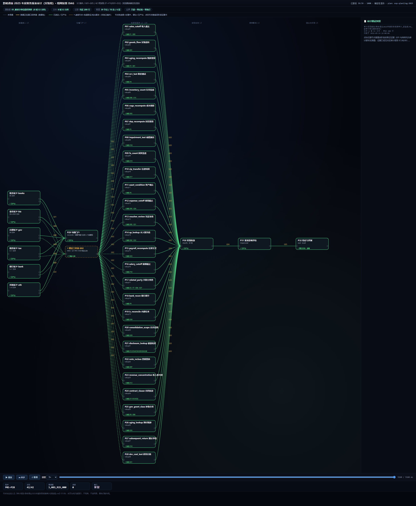
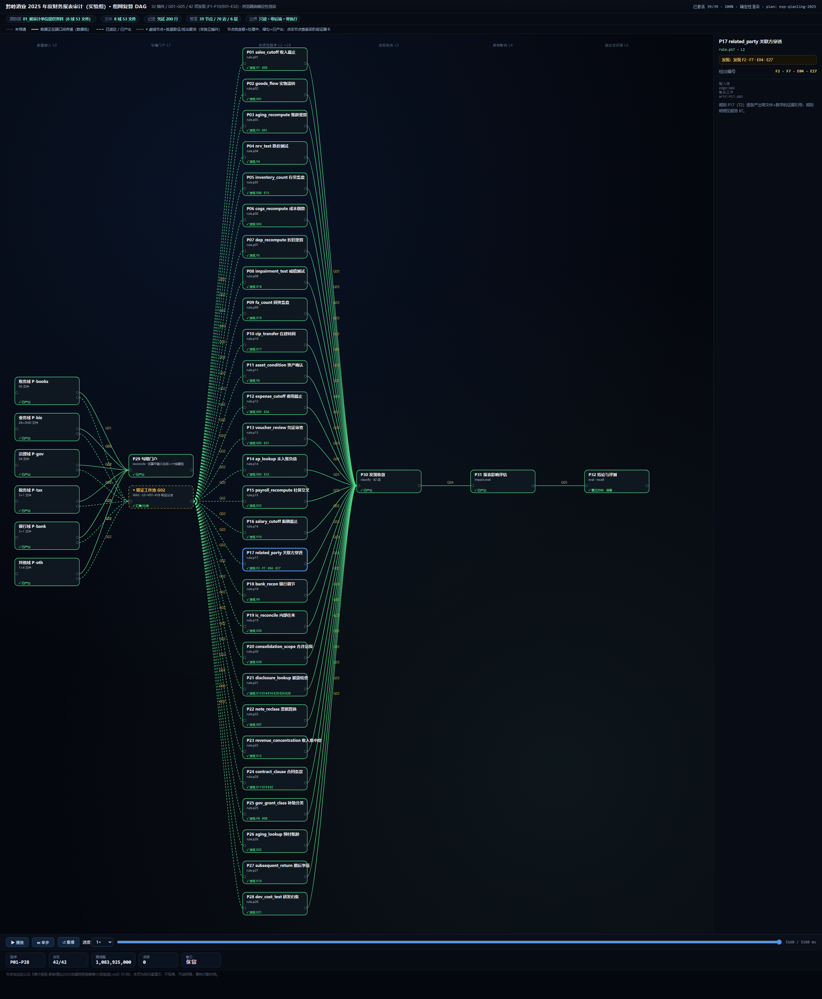
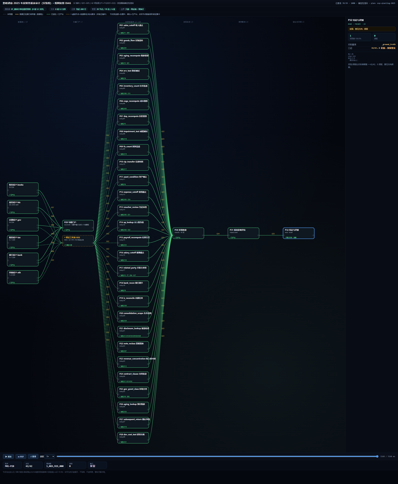

# 组网渲染流程图报告：黔岭酒业 2025 年度财务报表审计（实验组）

> 报告日期：2026-09-15
> 关联文件：[审计报告-黔岭酒业2025年度财务报表审计(实验组).md](./审计报告-黔岭酒业2025年度财务报表审计(实验组).md)（§7 插件规格 / §8 组网拓扑为本文权威依据）
> 渲染页：[`../_flow_render/index.html`](../_flow_render/index.html)（双击即可播放；无头截屏帧见 `../_flow_render/shots/`）

## 一、如何查看这幅流程图

| 操作 | 方式 | 说明 |
| --- | --- | --- |
| 播放 / 暂停 | 左下角 `⏸ 暂停` / `▶ 播放` | 数据自 L0 六域接入向 L5 结论单向流动 |
| 单步 | `⏭ 单步` | 每步推进到下一层节点激活边界 |
| 重播 / 速度 | `↺ 重播`、速度 0.5×–4× | 复看任意阶段 |
| 拖动时间轴 | 底部拖动条 | 任意时刻照片；`#t=毫秒` 可直接定位 |
| 节点证据卡 | 点击任意节点 | 右侧面板展示该程序 KPI、传样与证据口径 |
| 图例 | 顶部说明条 | 灰=未导通、金=数据包传递、绿=已产出、◆虚线=批量取证聚合节点 |

## 二、组网拓扑总览（对应审计报告 §7/§8）

| 维度 | 数值 | 说明 |
| --- | --- | --- |
| 分层 | 6 层（L0 六域接入 → L1 勾稽门户 → L2 实质性程序×28 → L3 发现收敛 → L4 报表影响 → L5 结论与评测） | 严格单向、无回边，DAG 成立 |
| 节点 | 39 个（L0 六域 P-books/P-biz/P-gov/P-tax/P-bank/P-oth + P29 门户 + P01–P28 程序 + P30 收敛 + P31 影响 + P32 结论 + 2 虚拟汇聚） | 32 插件与报告 §7 P01–P32 全量对应 |
| 边 | G01–G05（图中 70 条带标签边） | 层间 5 条聚合边；G02 经"取证工件池"虚拟节点承载 28 条并行取证边 |
| 发现 | F1–F10 + E01–E32（42 项） | 由 P01–P28 逐程序产出，标在节点上 |
| 关键结果 | 试算平衡 3/3、召回 42/42、误报 0、需调整 32 项 1,083,925,000、意见保留 | 与报告 §0/§6 一致 |

- **宽扇入**：L0 六域（账务/业务/治理/税务/银行/其他）→ P29 勾稽门户（G01），试算平衡 3 主体全部成立；
- **并行分叉**：L2 P01–P28 共 28 条程序同时激活、互不依赖（G02 从证据工件池并行取证）；
- **单点收敛**：L3 P30（发现收敛 42 项）→ L4 P31（报表影响 1,083,925,000）→ L5 P32（结论与评测，对照 `_ground_truth`）；
- **只读血缘**：全部边均为读取+引用，无写源、无外部调用（报告 §8.3）。

## 三、逐帧渲染截图与解释

以下 6 帧均为从渲染页按时间轴定位后的确定性截屏（同一时间应得到完全相同的画面；实验组引擎时长 5,460 ms）。

### 帧 1/6 · 组网初始：L0 六域接入处理中（t≈180 ms）

- **画面**：左侧 L0 六个接入域（P-books 账务 / P-biz 业务 / P-gov 治理 / P-tax 税务 / P-bank 银行 / P-oth 其他）高亮为"处理中"，右侧尚未亮起；
- **解释**：接入层正在把 8 组证据域 53 个文件（41 CSV + 12 MD）读成行式工件——科目余额表 ×3、记账凭证 200 行、28 个业务明细+2 个盘点域、治理/税务/银行/披露域各文件，金额统一 Decimal 标准化；
- **对应报告**：§1 审计范围、§2 数据、§9 数据样貌（L0 接入即为 §8.1 首行）。

### 帧 2/6 · 数据包在端口间传递（t≈700 ms）

- **画面**：金色数据点沿 L0→P29（G01）与 L0→取证工件池（G02）的连线上流动，L1 尚未激活；
- **解释**：六域行式工件经 G01 送入 P29 勾稽门户做试算平衡；同时各域证据工件经 G02 向 L2 的 28 条程序并行分发（实物流转 P02、账龄重算 P03、折旧重算 P07、关联方穿透 P17…各取所需证据）；
- **对应报告**：§8.2 G01/G02 连线明细。

### 帧 3/6 · 28 条实质性程序并行处理中（t≈1980 ms）

- **画面**：L2 的 P01–P28 全部点亮为"处理中"（金银描边 + "● 处理中"状态行），P29 与证据池已绿色"已产出"；
- **解释**：28 条确定性程序彼此独立并行（无内部依赖）；节点下方状态行随后逐一显示各自产出的发现编号（P01→F1·E09、P02→E01、P03→F3·E01、P17→F2·F7·E04·E27 …）；
- **对应报告**：§7 P01–P28 规则清单；§8.3"L2 28 路并行分叉"。

### 帧 4/6 · 全链路导通（t≈5460 ms，结束态）

- **画面**：全图节点绿色"已产出"，边变为绿色虚线"已送达"；P29→P01–P28→P30 收敛→P31 影响→P32 结论全部导通；
- **解释**：读出关键结果：42 项发现编号归口（错报 27 / 舞弊 4 / 披露 9 / 内控 2）、需调整 32 项合计 1,083,925,000、召回 42/42、误报 0、意见方向"保留"；
- **对应报告**：§0 结论摘要、§6 结论。

### 帧 5/6 · 节点证据卡：P17（关联方穿透）

- **画面**：点击 P17 后节点蓝色高亮，右侧面板展示证据卡；
- **证据卡内容**：`发现：F2 · F7 · E04 · E27`；输入行 `组织架构(MD)；供应商/其他应收/销售` + `关联清单`；说明"近亲属企业 × 供应商/客户/债务人 − 申报清单 → 关联方穿透"；
- **解释**：这是"可追溯"的体现——F7 可回溯到 `其他应收款明细.债务方=黔岭物流 25,000,000 / ★ 否（未申报）` + 组织架构"董事之弟"（报告 §7 P17 传样）；E04 同时由实物流转 P02 等信号互证；
- **对应报告**：§8.4 P17 逐插件注释。

### 帧 6/6 · 节点证据卡：P32（结论与评测）

- **画面**：点击 P32 结论节点，面板展示 `判定：召回率 100.0%、误报 0` 与行 `对拍基准 _ground_truth`、`口径 42/42、0 误报、保留意见`；
- **解释**：L5 收口——把 P30 归类、P31 影响与标准答案 `_ground_truth` 对拍，得到 42/42 召回、0 误报的最终评测结论；
- **对应报告**：§8.4 P32；§6 结论。

## 四、边模型说明（G01–G05）

| 边 | 图中画法 | 报告定义（§8.2） |
| --- | --- | --- |
| G01 | L0 六域 → P29（6 条实线） | 六域行式工件全量 → P29 勾稽门户（试算平衡 3 主体 + 建档） |
| G02 | L0 → ◆取证工件池 → P01–P28（28 条虚线批量边） | L0 证据 → 28 条并行取证边（画法以虚拟汇聚节点表达，非独立插件） |
| G03 | P01–P28 → P30（28 条汇聚边） | 42 项检出（编号/金额/证据引用/规则 key）→ P30.materiality |
| G04 | P30 → P31（串联） | 需调整 32 项 1,083,925,000 + 处理方式分类（错报 27/舞弊 4/披露 9/内控 2） |
| G05 | P31 → P32（串联） | 影响评估 + 标准答案对拍 → 意见方向（保留） |

## 五、一致性核对与边界声明

| 核对项 | 渲染页 | 审计报告 |
| --- | --- | --- |
| 插件数 | 39 节点（32 插件 + 6 域接入 + 1 虚拟取证池） | §7 P01–P32（32 插件） |
| 发现数 | F1–F10 / E01–E32 | §6.2 42 项（F1–F10/E01–E32） |
| 关键结果 | 42/42 召回 · 0 误报 · 1,083,925,000 · 保留 | §0 / §6.3 |

- **边界声明**：本渲染页为纯只读演示——不写库、不进网络、零执行副作用；图中所有金额与结论均为对应审计脚本实测值（`detect_issues.py` 输出，见报告 §6 首句口径）；G01–G05 及各程序级边的权威逐条定义以审计报告 §8.2/§8.4 为准，本图在其上做聚合表达。

## 六、模式设置（AI 全自动 / 人修改 + AI 微调）

渲染页顶部新增**组网模式**切换：

| 模式 | 含义 | 中间人可做什么 |
| --- | --- | --- |
| **AI 全自动**（默认） | 组网由确定性引擎生成，图表只读 | 只能查看动画、拖动时间轴、点击节点看证据卡，不能改组网 |
| **人修改 + AI 微调** | 中间人对组网做修改，AI 引擎做一致性微调 | 可增删改节点、连线、层级、参数阈值、发现与证据 |

切换方式：点击顶部分组"组网模式"下的单选钮；或直接以 URL 打开指定模式（默认 `index.html` 为 AI 全自动，追加 `#m=manual` 直接进入人工编辑态）。

**人工编辑能力（对应你的"中间人能否改组网"）**：

1. **节点与连线**：编辑工作台新增节点（ID/名称/层级/cap）、删除节点（自动清理相关连线）；点击任意图上节点进入单节点编辑，改名/换层，重命名节点 ID 时图中连线端点自动同步；新增/删除连线（自环被拒绝）。本案例 39 节点（32 插件 + 6 域接入 + 1 虚拟取证池）/ 70 条带标签边（G01–G05 聚合画法）均可操作。
2. **参数与阈值**：每个节点的"参数与阈值（kpi）"可增删改——值、标签、小数位（如坏账计提比例、折旧差额 100 元阈值、重大性判定额度）在线编辑。
3. **发现与证据**：节点"发现（finding）"与"发现与证据（rows，键值对传样）"可增删改，支持多行证据行——F1–F10 与 E01–E32 共 42 项，逐条可对照 `detect_issues.py` 输出锚定的文件与关键数字。

**AI 微调（本地确定性规则引擎）**：运行一致性检查，扫描并提示——节点 ID 重复、连线悬空（起点/终点不存在）、自环、层级越界、非虚拟实质性程序缺 finding、参数值非法；支持"一键修复全部"（自动删除悬空/自环连线、收敛越界层级、非法参数归零）。规则引擎为纯前端确定性实现，**零后端、零网络、零执行副作用**，与渲染引擎同一约束。

**保存与导出**：全部改动先写回浏览器内存副本；点"保存草稿并刷新预览"持久化到 localStorage（按键 `audit_dag_draft_<plan>`）并按草稿整页重渲染；"导出组网 JSON"可下载 `组网-人工微调-<plan>.json`；"重置为原始组网"清除草稿回到 AI 全自动结果。

> 边界声明：编辑能力仅为**演示层的人机协同**，页面仍是纯只读演示——不写库、不触达真实基础设施；草稿仅存在本机浏览器。真实执行的修改仍须遵守项目"plan_only 模式、禁止 execute/auto 自动执行"的契约约束。