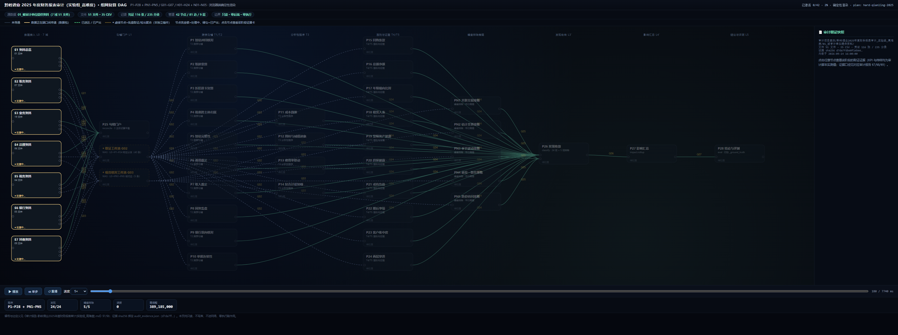
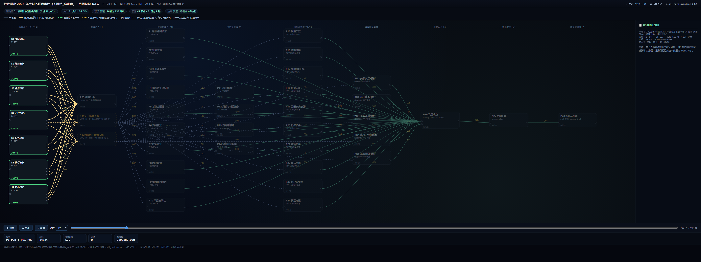
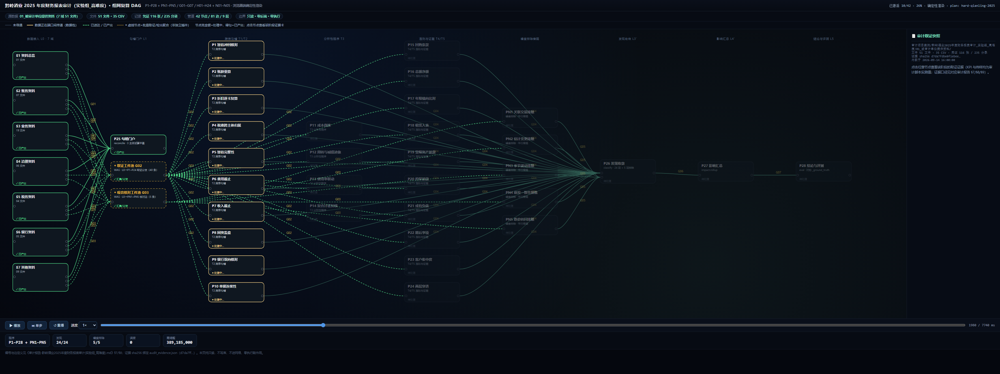
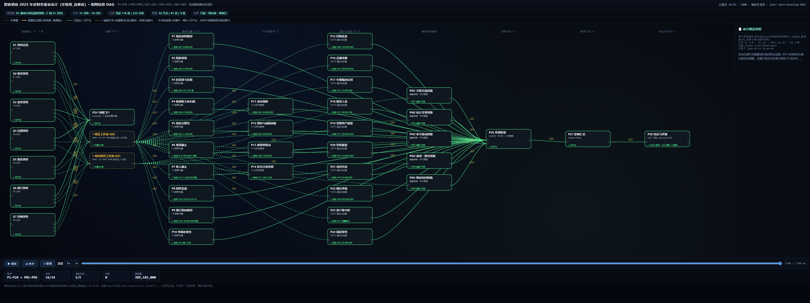
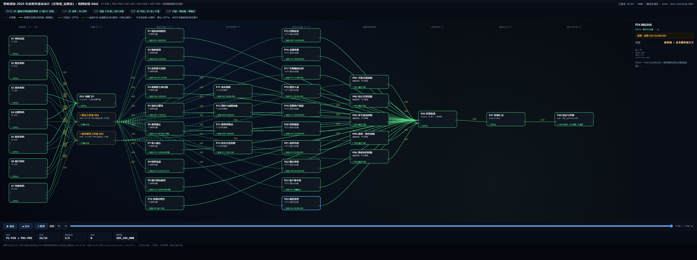
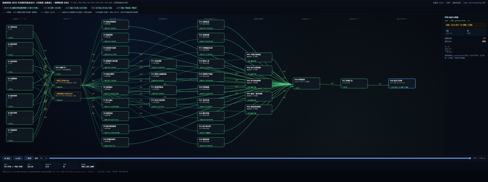

# 组网渲染流程图报告：黔岭酒业 2025 年度财务报表审计（实验组_高难度）

> 报告日期：2026-09-15
> 关联文件：[审计报告-黔岭酒业2025年度财务报表审计(实验组_高难度).md](./审计报告-黔岭酒业2025年度财务报表审计(实验组_高难度).md)（§7 插件规格 / §8 组网拓扑为本文权威依据）
> 渲染页：[`_flow_render/index.html`](./_flow_render/index.html)（双击即可播放；无头截屏帧见 `_flow_render/shots/`）

## 一、如何查看这幅流程图

| 操作 | 方式 | 说明 |
| --- | --- | --- |
| 播放 / 暂停 | 左下角 `⏸ 暂停` / `▶ 播放` | 数据自 L0 七域接入向 L5 结论单向流动 |
| 单步 | `⏭ 单步` | 每步推进到下一层节点激活边界 |
| 重播 / 速度 | `↺ 重播`、速度 0.5×–4× | 复看任意阶段 |
| 拖动时间轴 | 底部拖动条 | 任意时刻照片；`#t=毫秒` 可直接定位 |
| 节点证据卡 | 点击任意节点 | 右侧面板展示该程序 KPI、传样与证据口径 |
| 图例 | 顶部说明条 | 灰=未导通、金=数据包传递、绿=已产出、◆虚线=批量取证/噪音核对聚合节点 |

## 二、组网拓扑总览（对应审计报告 §7/§8）

| 维度 | 数值 | 说明 |
| --- | --- | --- |
| 分层 | 9 层（L0 七域接入 → L1 勾稽门户 → L2 跨表勾稽 T1/T2 → L3 分析性程序 T3 → L4 准则与证据 T4/T5 → 噪音排除旁路 → L3′ 发现收敛 → L4′ 影响汇总 → L5 结论与评测） | 严格单向、无回边，DAG 成立 |
| 节点 | 42 个（L0 七域 S1–S7 + P25 门户 + P1–P28 + PN1–PN5 噪音排除器 + P26 收敛 + P27 影响 + P28 结论 + 2 虚拟汇聚） | 与报告 §7 P1–P28/PN1–PN5 全量对应 |
| 边 | G01–G07（图中 81 条带标签边） | 层间 7 条聚合边；G02 承载 40 条并行取证边、G03 承载 5 条噪音核对边（虚拟汇聚表达） |
| 发现 | H01–H24（24 项，含 5 项披露缺口） | 由 P1–P24 逐程序产出；PN1–PN5 为排除旁路（通过·不报） |
| 关键结果 | T3–T5 共 16 项（67%）需分析/判断检出；命中 24/24、排除 5/5、误报 0、需调整 389,185,000.00、意见保留 | 与报告 §0/§6 一致 |

- **宽扇入**：L0 七域（资料总览/账务/业务/治理/税务/银行/其他，51 文件）→ P25 勾稽门户（G01），3 主体试算平衡全部成立——"账必平"把错报逼入单据层；
- **能力分层并行**：L2 跨表勾稽（P1–P10，T1/T2）→ L3 分析性程序（P11–P14，T3）→ L4 准则与证据（P15–P24，T4/T5）三组逐层推进，同层并行、层间单向；
- **噪音平行旁路**：PN1–PN5 经 G03 独立取证核对（关联交易/估计变更/季节波动/募投一致/跌价转回），全部"通过·不报"，防误报；
- **双线收敛**：24 项发现（G04）与 5 项排除（G05）在 P26 汇合 → P27 影响汇总 → P28 对拍 `_ground_truth`；
- **只读血缘**：全部边均为读取+引用，无写源、无外部调用，证据 sha256 绑定 `audit_evidence.json`（报告 §5.2）。

## 三、逐帧渲染截图与解释

以下 6 帧均为从渲染页按时间轴定位后的确定性截屏（同一时间应得到完全相同的画面；高难度引擎时长 8,040 ms）。

### 帧 1/6 · 组网初始：L0 七域接入处理中（t≈180 ms）

- **画面**：左侧 L0 七个接入域（S1 资料总览 / S2 账务 / S3 业务 / S4 治理 / S5 税务 / S6 银行 / S7 其他）高亮为"处理中"，右侧尚未亮起；
- **解释**：接入层正在把 7 域 51 文件（35 张 CSV 普查）读成行式工件——3 主体科目余额表 44+ 行、记账凭证 116 张 235 条分录、业务明细 19 件、治理 6 件、税务 4 件、银行 5 件、其他 9 件，金额统一 Decimal 标准化；
- **对应报告**：§1 审计范围、§2 数据、§9 数据样貌。

### 帧 2/6 · 数据包在端口间传递（t≈700 ms）

- **画面**：金色数据点沿 L0→P25（G01）与 L0→取证/噪音工件池（G02/G03）的连线上流动，L1 尚未激活；
- **解释**：七域行式工件经 G01 送入 P25 勾稽门户做试算平衡；各域证据工件经 G02 向 L2–L4 的 24 条程序并行分发（P1 暂估冲回取"发票×入库暂估+预付款账龄"、P9 银行双向核对取日记账/对账单…），噪音输入经 G03 向 PN1–PN5 分送；
- **对应报告**：§8.2 G01/G02/G03 连线明细。

### 帧 3/6 · 24 条程序多路并行处理中（t≈1980 ms）

- **画面**：L2（P1–P10 跨表勾稽）、L3（P11–P14 分析性程序）、L4（P15–P24 准则与证据）节点相继点亮"处理中"，P25 与取证池已绿色"已产出"；
- **解释**：能力分层逐层推进——T1/T2（发票×入库、账龄重算、折旧逐卡复算、税费交叉归属…）先行，T3（成本倒推、周转与减值、费用率联动、复合计征）次之，T4/T5（回购条款、总额净额、租赁入表、两层穿透…）判定类最后；状态行随后显示各自产出（P14→H11 3,821,240、P18→H13 38,965,500、P24→H24 26,000,000…）；
- **对应报告**：§7 L2/L3/L4 插件清单；§8.3"能力分层"。

### 帧 4/6 · 全链路导通 + 噪音旁路收口（t≈8040 ms，结束态）

- **画面**：全图节点绿色"已产出"，边变为绿色虚线"已送达"；L2→L3→L4→P26 收敛→P27 影响→P28 结论全部导通，噪音排除链路（PN1–PN5 → P26）同步"通过·不报"；
- **解释**：读出关键结果：24 项发现（金额类 22 项）、5 项排除、需调整合计 389,185,000.00、命中 24/24、误报 0、意见方向"保留"；
- **对应报告**：§0 结论摘要、§6 结论。

### 帧 5/6 · 节点证据卡：P24（两层穿透，T5 职业判断类）

- **画面**：点击 P24 后节点蓝色高亮，右侧面板展示证据卡；
- **证据卡内容**：`发现：H24 26,000,000`；原理行 `股权链 × 近亲属申报交叉`；说明"P24 → H24（证据=文件+行/值+单据编号）"；
- **解释**：这是 T5 职业判断类发现的代表——H24 需把股权结构链与近亲属申报交叉比对才能定位，确定性规则无法直接检出（T3–T5 共 16 项、占 67%）；证据可回溯至具体文件与键值；
- **对应报告**：§7 P24；§8.4 逐插件注释。

### 帧 6/6 · 节点证据卡：P28（结论与评测）

- **画面**：点击 P28 结论节点，面板展示 `判定：24/24 命中 · 5/5 排除 · 0 误报` 与行 `对拍基准 _ground_truth`、`意见方向 保留`；
- **解释**：L5 收口——24 项发现与 5 项排除同时对照标准答案，得到 24/24 命中、5/5 排除、0 误报的最终评测结论；
- **对应报告**：§8.4 P28；§6 结论。

## 四、边模型说明（G01–G07）

| 边 | 图中画法 | 报告定义（§8.2） |
| --- | --- | --- |
| G01 | L0 七域 → P25（7 条实线） | 七域 51 文件行式工件全量 → P25 勾稽门户（3 主体试算平衡） |
| G02 | L0 → ◆取证工件池 → P1–P24（40 条虚线批量边） | L0 证据 → 24 条程序并行取证（画法以虚拟汇聚节点表达，非独立插件） |
| G03 | L0 → ◆噪音核对工件池 → PN1–PN5（5 条虚实边） | L0 噪音输入 → 5 条平行旁路核对边（关联交易/估计变更/季节波动/募投/跌价转回） |
| G04 | P1–P24 → P26（24 条汇聚边） | 24 项检出（编号 H01–H24、T1–T5 分层、认定分组、金额、证据引用） |
| G05 | PN1–PN5 → P26（5 条汇聚边） | 5 项排除结论（附核对路径与放行理由） |
| G06 | P26 → P27（串联） | 24 项分类 + 需调整合计 389,185,000.00（金额类 22 项） |
| G07 | P27 → P28（串联） | 影响评估 + 与 `_ground_truth` 对拍 → 24/24 命中、5/5 排除、0 误报 → 保留 |

## 五、一致性核对与边界声明

| 核对项 | 渲染页 | 审计报告 |
| --- | --- | --- |
| 插件数 | 42 节点（P1–P28 + PN1–PN5 + P25–P28 收口 + 2 虚拟汇聚） | §7 P1–P28/PN1–PN5（32 插件） |
| 发现数 | H01–H24（24 项） | §6.1 H01–H24 逐项命中 |
| 噪音排除 | N01–N05 通过·不报 | §6.2 5/5 通过、0 误报 |
| 关键结果 | 24/24 · 5/5 · 0 误报 · 389,185,000 · 保留 | §0 / §6.3 |

- **边界声明**：本渲染页为纯只读演示——不写库、不进网络、零执行副作用；图中所有金额与结论均为 `_tools/audit_verify_hard.py` 实测值（证据 sha256 绑定 `audit_evidence.json`，见报告 §5.2）；G01–G07 及各程序级边的权威逐条定义以审计报告 §8.2/§8.4 为准，本图在其上做聚合表达。